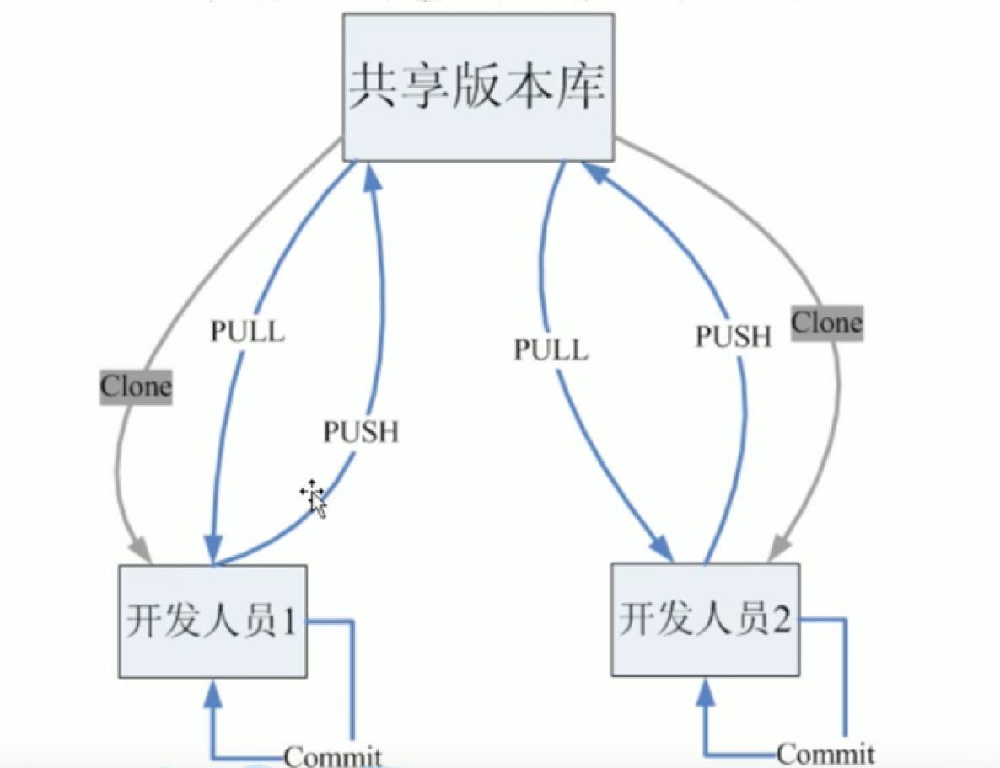
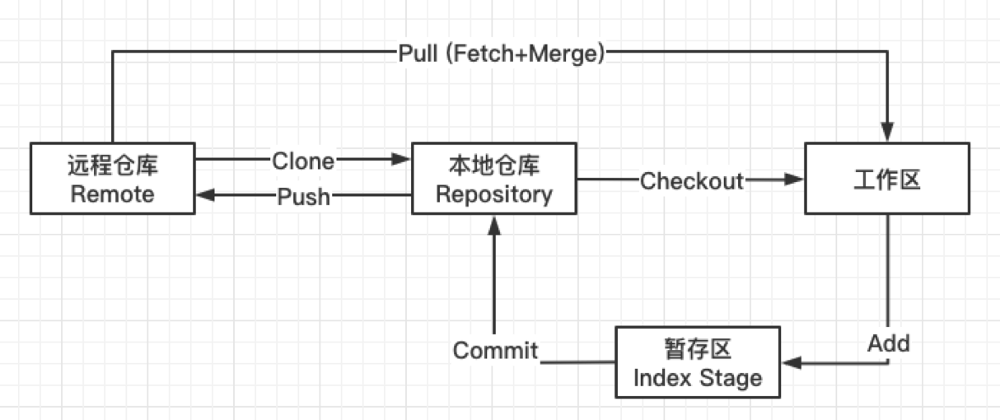

### SVN

​		之前公司用的svn属于集中式管理，有一个中央服务器，所有人都跟svn的中央服务器沟通。所以每个人都必须先从中央服务器拿到最新版本，然后干活，干完活后再推送到中央服务器。

### Git

​		Git是分布式版本控制系统，所以它就没有中央服务器，每个人的电脑都是一个完整的版本库，这样工作的时候就不需要联网和中央服务器沟通了。

​		当需要多人协作的时候，自己修改了文件A，其他人也修改了文件A，这时只需要把各自的修改推送给对方，就可以互相看到对方的修改了。

​		如图：

​				

假如只要一个开发人员，那么也可以不需要远程仓库，既共享版本库。

假如有多个开发人员，那么就要用到远程仓库来交换数据。

### Git的工作流程

看图：

​			

1、从远程仓库中克隆一个项目到本地，作为本地的仓库。

2、从本地仓库中checkout代码，然后对代码进行修改。

3、先交代码add到暂存区

4、commit提交代码到本地仓库。本地仓库中就保存了项目的各个历史版本。

5、将改动push到远程仓库和其他团队成员共享。

