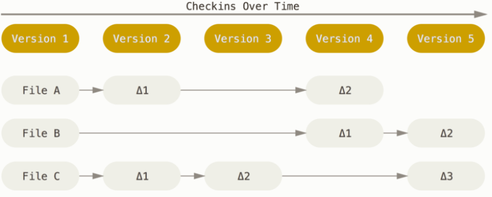
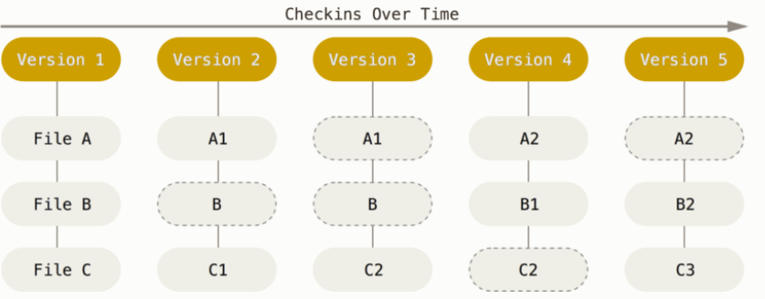

#### Git 是什么？

​	Git 究竟是怎样的一个系统呢？ 请注意接下来的内容非常重要，若你理解了 **Git 的思想和基本工作原理**，用起来就会知其所以然，游刃有余。

#### 直接记录快照，而非差异比较

​	Git 和其他版本控制系统（比如Subversion等）的主要差别在于 Git 对待数据的方式。
​	从概念上说，其他版本控制系统是**以文件变更列表的方式**存储版本信息，具体来说就是：一组基本文件和每个文件随时间变化逐步积累的差异。通常称作：**基于差异（delta-based）**的版本控制。

​														**图：存储每个文件与初始版本的差异**

​	Git 不按照以上的方式保存数据。反之，Git 更像是把数据看作是对小型文件系统的一系列快照。在Git中，每次提交更新或保存项目状态时，它基本上就会对当时的全部文件创建一个快照并保存这个快照的索引。 为了效率，如果文件没有修改，Git 不再重新存储该文件，而是只保留一个链接指向之前存储的文件。 Git 对待数据更像是一个 快照流。

​														**图：存储项目随时间改变的快照.**

#### 近乎所有操作都是本地执行

​	在 Git 中的绝大多数操作都只需要访问本地文件和资源。而非像集中式版本控制系统基本所有所有操作都有网络延时开销。因为本地磁盘上就有项目的完整历史，所以大部分操作基本上瞬间完成。
​	举个例子，要浏览项目历史，Git 不需外连到服务器去获取历史，然后再显示出来——它只需直接从本地数据库中读取， 你能立即看到项目历史。

#### Git 保证完整性

​	Git 中所有的数据在存储前都计算校验和，然后以校验和来引用。 这意味着不可能在 Git 不知情时更改任何文件内容或目录内容。比如，若你在传送过程中丢失信息或损坏文件，Git 就能发现。
​	Git 用以计算校验和的机制叫做 SHA-1 散列（hash译为散列，散列=哈希）。 散列值通常的呈现形式为40个十六进制数。 SHA-1 哈希看起来是这样：

```
24b9da6552252987aa493b52f8696cd6d3b00373
```

​	Git 中使用这种哈希值的情况很多，你将经常看到这种哈希值。 实际上，Git 数据库中保存的信息都是以文件内容的哈希值来索引，而不是文件名。

#### Git 的三种状态

​	现在请注意，如果你希望后面的学习更顺利，请记住下面这些关于 Git 的概念。 Git 有三种状态，你的文件可能处于其中之一：

- 已修改（modified）：在工作区修改过的文件，需要 add 到暂存区

- 已暂存（staged）：暂存区存储的修改好的文件，等着 commit 到仓库

- 已提交（committed）：已提交表示仓库中已经安全保存好文件

  ​			
  ​														图：Git 的工作流程

  ​	**工作区**是对项目的某个版本独立提取出来的内容。 放在磁盘上供你使用或修改。

  ​	**暂存区**其实是一个文件，保存了下次将要提交的文件列表信息，一般在 Git 仓库目录中。 按照 Git 的术语叫做“索引”，不过一般说法还是叫“暂存区”


