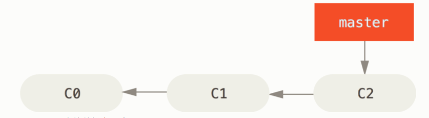
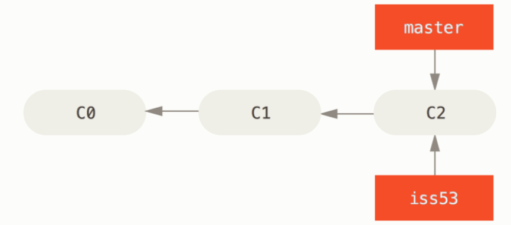
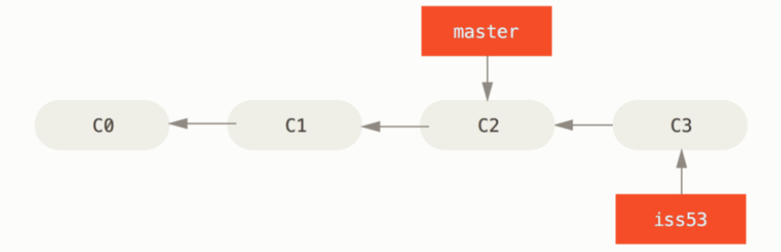
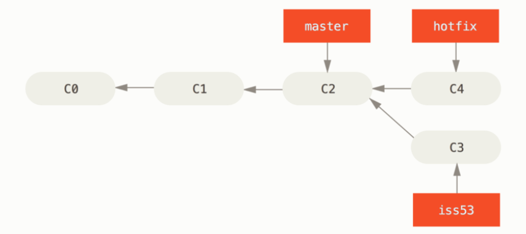
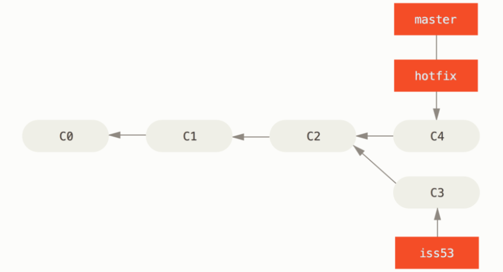
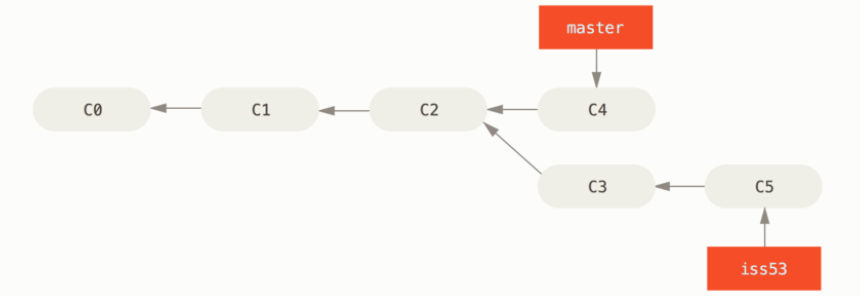
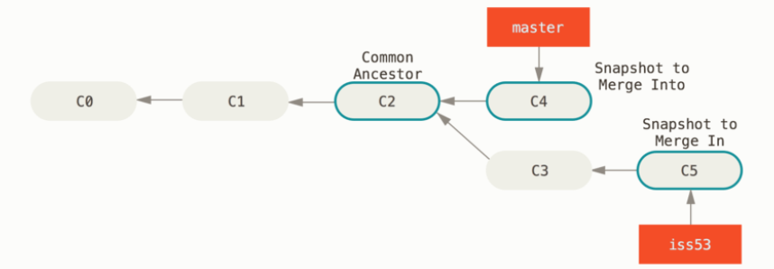
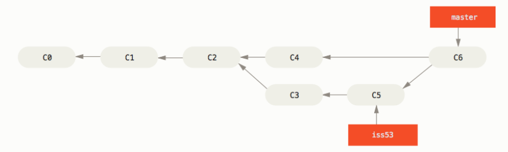

#### 分支的新建与合并

让我们来看一个简单的分支新建与分支合并的例子，实际工作中你可能会用到类似的工作流。 你将经历如下步骤：

1. 开发某个网站。
2. 为实现某个新的用户需求 issue53，创建一个分支。
3. 在这个分支上开展工作。

正在此时，你突然接到一个电话说有个很严重的问题需要紧急修补。 你将按照如下方式来处理：

1. 切换到你的线上分支（production branch，即主分支）。
2. 为这个紧急任务新建一个分支 hotfix，并在其中修复它。
3. 在测试通过之后，切换回线上分支，然后合并这个修补分支，最后将改动推送到线上分支。
4. 切换回你最初工作的 issue53 分支上，继续工作。

#### 新建分支

​	首先，我们假设你正在你的项目上工作，并且在 `master` 分支上已经有了一些提交。


​	现在，你要解决 #53 问题，想要新建一个分支并同时切换到那个分支上，你可以运行一个带有 `-b` 参数的 `git checkout` 命令：

```
$ git checkout -b iss53
Switched to a new branch "iss53"
```



​	你继续在 #53 问题上工作，并且做了一些提交。 在此过程中，`iss53` 分支在不断的向前推进，因为你已经检出到该分支 （也就是说，**你的 `HEAD` 指针指向了 `iss53` 分支**）。


​	现在你接到那个电话，需要解决一个紧急问题。有了 Git 的帮助，你不必把这个紧急问题和 `iss53` 的修改混在一起， 你也不需要花大力气来还原关于 53# 问题的修改，然后再添加关于这个紧急问题的修改，最后将这个修改提交到线上分支。 你所要做的仅仅是切换回 `master` 分支。
​	但是，在你这么做之前，要留意你的工作目录和暂存区里那些还没有被提交的修改， 它可能会和你即将检出的分支产生冲突从而阻止 Git 切换到该分支。 最好的方法是，**在你切换分支之前，保持好一个干净的状态。** 也就是说，该add的add的，该提交的提交，都整理干净了再切换分支。 现在，我们假设你已经把你的修改全部提交了，这时你可以切换回 `master` 分支了：

```
$ git checkout master
Switched to branch 'master'
```

​	这个时候，你的工作目录和你在开始 #53 问题之前一模一样，现在你可以专心修复紧急问题了。 请牢记：当你切换分支的时候，Git 会重置你的工作目录，使其看起来像回到了你在那个分支上最后一次提交的样子。 Git 会自动添加、删除、修改文件以确保此时你的工作目录和这个分支最后一次提交时的样子一模一样。

​	接下来，你要修复这个紧急问题。 我们来建立一个 `hotfix` 分支，在该分支上工作直到问题解决：

```
$ git checkout -b hotfix
Switched to a new branch 'hotfix'
```



​	然后，假设紧急问题已经经过测试，确保修改好了。你要将 `hotfix` 分支合并回你的 `master` 分支来部署到线上。 你可以使用 `git merge` 命令来达到上述目的：

```
$ git checkout master
$ git merge hotfix
Updating f42c576..3a0874c
Fast-forward
... ...
```

​	在合并的时候，你应该注意到了“快进（fast-forward）”这个词。由于你想要合并的分支 `hotfix` 所指向的提交 `C4` 是你所在的提交 `C2` 的直接后继。 **因此 Git 会直接将指针向前移动。**换句话说，当你试图合并两个分支时， 如果顺着一个分支走下去能够到达另一个分支，那么 Git 在合并两者的时候， 只会简单的将指针向前推进（指针右移）。
**因为这种情况下的合并操作没有需要解决的分歧，这就叫做 “快进（fast-forward）”。**

​	此时，最新的修改已经在 `master` 分支所指向的提交快照中，你可以着手发布该修复了。


​	发布之后，你准备回到被打断之前时的工作中。 然而，你应该先删除 `hotfix` 分支，因为你已经不再需要它了 —— `master` 分支已经指向了同一个位置。 你可以使用带 `-d` 选项的 `git branch` 命令来删除分支：

```
$ git branch -d hotfix
Deleted branch hotfix (3a0874c).
```

​	现在你可以切换回你正在工作的分支继续你的工作，也就是针对 #53 问题的那个分支（iss53 分支）。

```
$ git checkout iss53
Switched to branch "iss53"
```



​	你在 `hotfix` 分支上所做的工作并没有包含到 `iss53` 分支中。 如果你需要拉取 `hotfix` 所做的修改，你可以使用 `git merge master` 命令将 `master` 分支合并入 `iss53` 分支，或者你也可以等到 `iss53` 分支完成其使命，再将其合并回 `master` 分支。

#### 合并分支

​	假设你已经修正了 #53 问题，并且打算将你的工作合并入 `master` 分支。 为此，你需要合并 `iss53` 分支到 `master` 分支，这和之前你合并 `hotfix` 分支所做的工作差不多。 你只需要检出到你想合并入的分支，然后运行 `git merge` 命令：

```
$ git checkout master
Switched to branch 'master'
$ git merge iss53
```

​	这和你之前合并 `hotfix` 分支的时候看起来有一点不一样。 在这种情况下，你的开发历史从一个更早的地方开始分叉开来（diverged）。 因为，`master` 分支所在提交并不是 `iss53` 分支所在提交的直接祖先，Git 不得不做一些额外的工作。 出现这种情况的时候，Git 会使用两个分支的末端所指的快照（`C4` 和 `C5`）以及这两个分支的公共祖先（`C2`），做一个简单的三方合并。如下图：


​	和之前将分支指针向前推进所不同的是，Git 将此次三方合并的结果做了一个新的快照并且自动创建一个新的提交指向它。 这个被称作一次合并提交，它的特别之处在于他有不止一个父提交。


​	既然你的修改已经合并进来了，就不再需要 `iss53` 分支了。 现在你可以在任务追踪系统中关闭此项任务，并删除这个分支。

```
$ git branch -d iss53
```

#### 解决合并分支的冲突

​	有时候合并操作不会如此顺利。 如果你在两个不同的分支中，对同一个文件的同一个部分进行了不同的修改，Git 就没法干净的合并它们。 如果你对 #53 问题的修改和有关 `hotfix` 分支的修改都涉及到同一个文件的同一处，在合并它们的时候就会产生合并冲突（conflicts）。
​	产生冲突可以使用 `git status` 命令来查看那些因包含合并冲突而处于未合并（unmerged）状态的文件。知道哪些文件有冲突后，我们就可以手动解决冲突。 Git 会在有冲突的文件中加入标准的冲突解决标记，看起来像下面这个样子：

```
<<<<<<< HEAD:index.html
<div id="footer">contact : email.support@github.com</div>
=======
<div id="footer">
 please contact us at support@github.com
</div>
>>>>>>> iss53:index.html
```

​	`HEAD`表示我们当前所在的分支，`=======` 的上半部分是HEAD的内容。
​	`iss53` 表示将要被合并的分支，`=======` 的下半部分是iss53的内容。
​	为了解决冲突我们必须选择两部分中的一个，或者你可以自行合并，比如，你可以通过把这段内容换成下面的样子来解决冲突：

```
<div id="footer">
please contact us at email.support@github.com
</div>
```

​	上述的冲突解决方案仅保留了其中一个分支的修改，并且 `<<<<<<<` , `=======` , 和 `>>>>>>>` **这些标记被完全删除了。**
​	在你解决了所有文件里的冲突之后，**对每个文件使用 `git add` 命令来将其标记为冲突已解决。** 一旦暂存这些原本有冲突的文件，Git 就会将它们标记为冲突已解决。然后就可以提交了。

