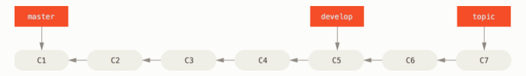
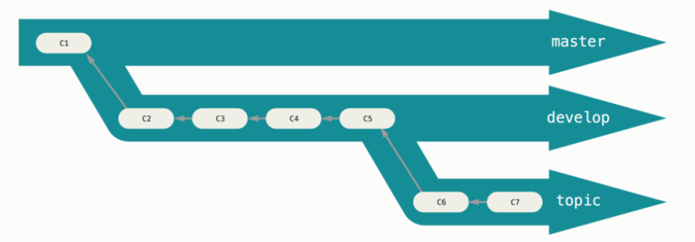
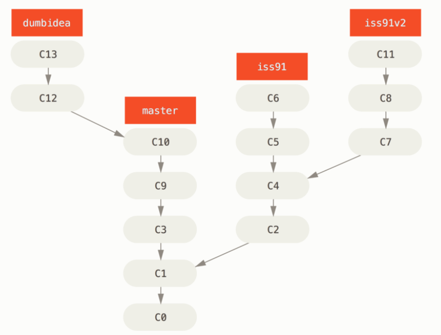
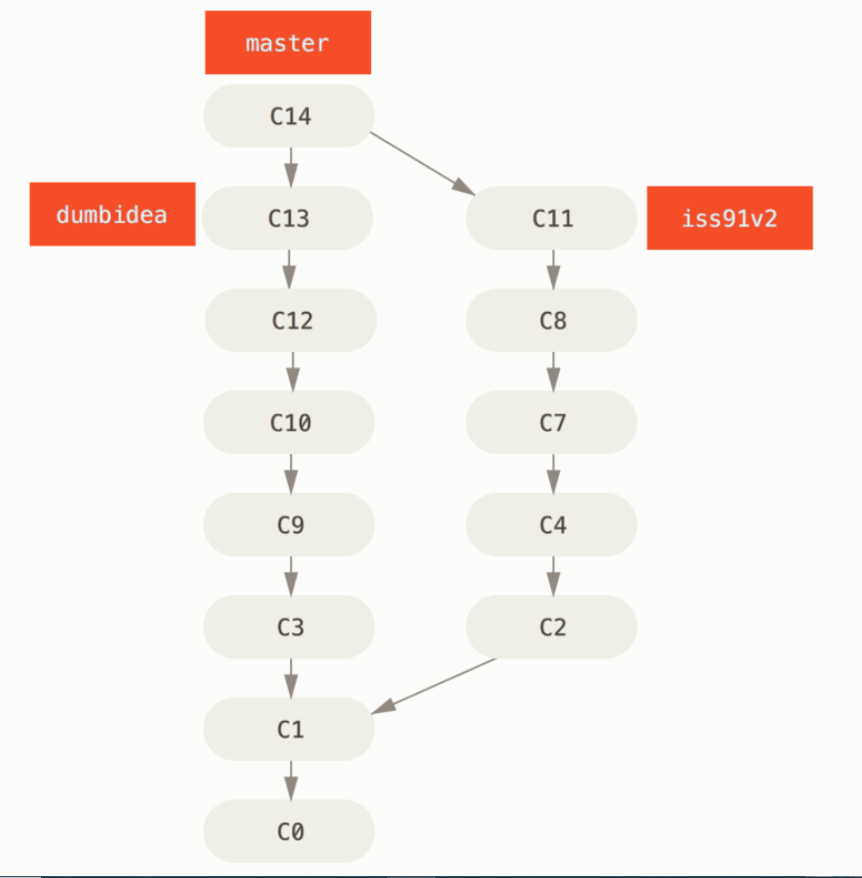

#### 长期分支

​	在 master 分支上保留稳定的代码，在其他一些名为 develop 或者 topic 的分支上，做后续的开发或者测试稳定性，这些分支一旦打到稳定状态，就可以被合并入 master 分支上了。
​	随着你的提交而不断右移的指针。 稳定分支的指针总是在提交历史中落后一大截，而前沿分支的指针往往比较靠前。

​	通常把他们想象成流水线（work silos）可能更好理解一点，那些经过测试考验的提交会被遴选到更加稳定的流水线上去。

​	你可以用这种方法维护不同层次的稳定性。 一些大型项目还有一个 `proposed`（建议） 或 `pu: proposed updates`（建议更新）分支，它可能因包含一些不成熟的内容而不能进入 `topic` 或者 `master` 分支。 这么做的目的是使你的分支具有不同级别的稳定性；当它们具有一定程度的稳定性后，再把它们合并入具有更高级别稳定性的分支中。

#### 主题分支

​	主题分支对任何规模的项目都适用。 主题分支是一种短期分支，它被用来实现单一特性或其相关工作。

​	你已经在上一节中你创建的 `iss53` 和 `hotfix` 主题分支中看到过这种用法。 你在上一节用到的主题分支（`iss53` 和 `hotfix` 分支）中提交了一些更新，并且在它们合并入主干分支之后，你又删除了它们。 这项技术能使你快速并且完整地进行上下文切换（context-switch）——因为你的工作被分散到不同的流水线中，在不同的流水线中每个分支都仅与其目标特性相关，因此，在做代码审查之类的工作的时候就能更加容易地看出你做了哪些改动。 你可以把做出的改动在主题分支中保留几分钟、几天甚至几个月，等它们成熟之后再合并，而不用在乎它们建立的顺序或工作进度。

​	考虑这样一个例子，你在 `master` 分支上工作到 `C1`，这时为了解决一个问题而新建 `iss91` 分支，在 `iss91` 分支上工作到 `C4`，然而对于那个问题你又有了新的想法，于是你再新建一个 `iss91v2` 分支试图用另一种方法解决那个问题，接着你回到 `master` 分支工作了一会儿，你又冒出了一个不太确定的想法，你便在 `C10` 的时候新建一个 `dumbidea` 分支，并在上面做些实验。 你的提交历史看起来像下面这个样子：
​						

​	现在，我们假设两件事情：你决定使用第二个方案来解决那个问题，即使用在 `iss91v2` 分支中方案。 另外，你将 `dumbidea` 分支拿给你的同事看过之后，结果发现这是个惊人之举。 这时你可以抛弃 `iss91` 分支（即丢弃 `C5` 和 `C6` 提交），然后把另外两个分支合并入主干分支（先把 `master` 分支快进到 dumbidea 分支，在三方合并为 `C14` 快照）。 最终你的提交历史看起来像下面这个样子：
​						

​	我们将会在 [分布式 Git](https://git-scm.com/book/zh/v2/ch00/ch05-distributed-git) 中向你揭示更多有关分支工作流的细节， 因此，请确保你阅读完那个章节之后，再来决定你的下个项目要使用什么样的分支策略（branching scheme）。

