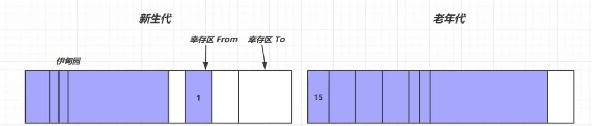

### 一、如何判断对象可以回收

#### 1、引用计数法

每个对象都有一个引用计数器，对象被引用一次计数+1。如果对象的引用计数为0，可以被GC回收。

但是假如A和B两个对象循环引用，因此：他们两个永远不会被GC回收。

主要是，现在主流JVM无一使用引用计数法来垃圾回收

#### 2、可达性分析法

目前几乎所有的JVM都用的可达性算法！

可达性算法，既**GC Roots Tracing**，最主要的便是找到 GC Roots（根对象）。

可达性算法判断某一个对象是否可以被回收：**看是否能够沿着 以GC Roots 对象为起点的引用链，找到该对象**，找不到，表示可以回收。

那哪些对象可以作为GC Roots？大概分为四类：

- **System class（java系统类）**
- **Native Stack（本地方法接口）**
- **Thread（线程）**
- **Busy Monitor（锁）**

根对象可以包括：（ JVM内存模型包括：程序计数器，虚拟机栈，本地方法栈，方法区，堆）

- 虚拟机栈的栈帧中局部变量表所引用的对象
- 方法区的静态变量或常量所引用的对象
- 本地方法栈JNI锁引用的对象

### 二、Java中的四种引用

1. **强引用**

   如果一个对象具有强引用，它就不会被垃圾回收器回收。即使当前内存空间不足，JVM也不会回收它，而是抛出 OutOfMemoryError 错误，使程序异常终止。如果想中断强引用和某个对象之间的关联，可以显式地将引用赋值为null，这样一来的话，JVM在合适的时间就会回收该对象。

2. **软引用**

   在使用软引用时，如果内存的空间足够，软引用就能继续被使用，而不会被垃圾回收器回收；只有在内存空间不足时，软引用才会被垃圾回收器回收。
   注意：java是提供了SoftReference类来实现软引用。

3. **弱引用**

   具有弱引用的对象拥有的生命周期更短暂。因为当 JVM 进行垃圾回收时，一旦发现弱引用对象，无论当前内存空间是否充足，都会将弱引用回收。不过由于垃圾回收器是一个优先级较低的线程，所以并不一定能迅速发现弱引用对象。
   注意：java是提供了WeakReference类来实现弱引用。

4. **虚引用**

   顾名思义，就是形同虚设，如果一个对象仅持有虚引用，那么它相当于没有引用，在任何时候都可能被垃圾回收器回收。
   虚引用必须和引用队列(ReferenceQueue)关联使用，当垃圾回收器准备回收一个对象时，如果发现它还有虚引用，就会把这个虚引用加入到与之关联的引用队列中。程序可以通过判断引用队列中是否已经加入了虚引用，来了解被引用的对象是否将要被垃圾回收。如果程序发现某个虚引用已经被加入到引用队列，那么就可以在所引用的对象的内存被回收之前采取必要的行动。
   注意：java是提供了PhantomReference类来实现虚引用。

5. **终结器引用**

   终结器引用也必须和引用队列(ReferenceQueue)关联使用。第一次垃圾回收，首先终结器引用入队列，但是注意被引用对象并未被回收，第二次垃圾回收时，由Finalizer线程找到被引用的对象，调用 finalize() 方法。所以被引用对象回收掉要经过两次GC。

### 三、垃圾回收算法

**1、标记清除算法**（mark sweep）
	第一步，标记可以回收的对象，记录地址；第二步，清除
	优点：速度快
	缺点：会造成内存碎片
**2、标记整理算法**（mark compact）
	第一步，标记可以回收的对象，记录地址；第二步，删除后并整理内存地址
	优点：没有内存碎片
	缺点：速度慢了
**3、复制：**
	From区域的拷贝到To区域，复制过去的时候不拷贝可回收对象。最后，清空From区域，把To区域拷贝过去。
	优点：没内存碎片
	缺点：要求双倍内存空间
	现在的JVM并不是单一用上面某种算法，而是结合三种算法，共同工作，具体实现就是分代机制

### 四、分代回收算法

​	当前商业虚拟机的回收算法都采用**分代收集**，它是根据对象的存活周期将内存划分为不同的几块。一般是把Java堆分为：新生代（new generation）和老年代（tenured generation）。

 **新生代包括：Eden空间 和 Survivor空间（Survivor From 和 Survivor To）**
 新生代中每经历一次minor GC存活下来的对象，年龄+1。阈值为15，超过15岁的会被放入老年代空间。

**所采用的的算法：**
在新生代中，每次垃圾回收有大量对象死去，幸存的是少量。所以用复制算法
在老年代中，每次垃圾回收却是大部分存活，少部分死去，一般使用标记-清除，或者标记-整理算法。

**分代回收主要思想是，对 不同存活周期的对象 采取不同的回收策略，以便于提高回收垃圾的效率。（因为这样就不用每次都GC对整个堆空间进行回收了）**

分代的好处：
简化了对象的分配，因为只需要在新生代分配内存即可。
分代以后回收垃圾对象的效率更高了。

#### 什么情况下触发垃圾回收？

**Minor GC：**指对新生代空间进行垃圾回收
	触发条件：当Eden空间不足时
	大概流程：当Eden空间不足时，触发垃圾回收，然后将存活的对象复制到From区，同时给存活对象年龄+1岁，此时Eden空间就清空了。最后把From区和To区指向交换。（只是交换指向的地址，实际物理存储位置并不改变）

**Full GC：**当老年代空间的不足了，会进行Full GC，先对新生代GC一次接着就对老年代GC

注意：GC会触发Stop-The-World (STW)机制。STW机制既在执行垃圾收集算法时，其他所有的用户线程都被挂起，全局停顿的一种机制。
垃圾收集器包括Serial，Serial Old，ParNew，Parallel Old，CMS收集器以及 G1收集器（全局范围）。

JVM重要参数：
	-Xms:  memory size，指定堆的初始大小
	-Xmx:  memory max，指定堆最大值是多少
	-Xmn:  memory new，指定新生代内存大小
	-Xss:    stack size，指定栈大小

-XX：+  参数

​	-XX:-UseParallelGC  
​	-XX:-UseSerialGC
​	-XX:+PrintGCDetails -verbose:gc	打印GC详情