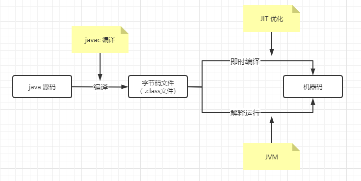

#### Java是面向过程的语言

1、面向过程和面向对象的区别：

​	面向过程：**面向过程的性能更高**，因为面向对象的类，调用时需要实例化，开销比较大，比较消耗资源。
​	面向对象：**面向对象易维护，易复用，易扩展**。因为面向对象拥有封装，继承，多态等特性，可以设计出低耦合的系统，使代码更易于维护。

2、java是编译与解释并存的语言

​	java是编译型语言：因为所有java代码都要编译成 .class 文件。（ **.class文件即：java字节码文件**）
​	java是解释型语言：java代码编译后也不能直接运行，它是解释运行在 JVM 上的。所以它是解释运行的。
​	但是现在的 JVM 为了效率，都有一些 JIT 优化。即把字节码文件直接编译为机器码，就像 C，C++ 一样直接编译为本地可运行的机器码。所以它又是编译的。（JIT：Just in time Compiler 即时编译）

