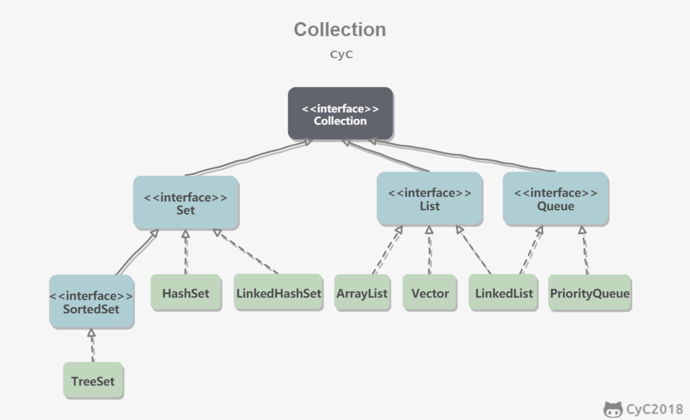
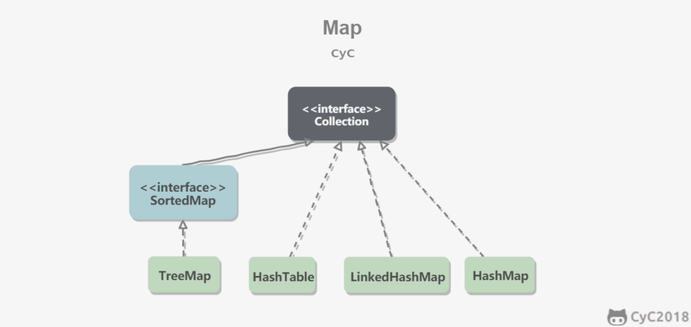

##  Collection



## Map




详细对比如下：

| **List接口**  |                                                              |
| ------------- | ------------------------------------------------------------ |
| ArrayList     | 动态数组，插入删除耗费时间多，但可以随机访问。扩容请求1.5倍。 |
| LinkedLisk    | LinkedList实现了 Queue 这个interface，所以java中的栈，队列，双向队列均用LinkedList实现**（offer插入，poll删除，peek查询）** |
| Vector        | Vector和ArrayList基本一致，除了Vector是线程安全（使用了synchronized同步），供多线程使用。扩容请求1.5倍 |
| **Set接口**   |                                                              |
| HashSet       | 基于哈希表实现，①去重 ②无序。 支持快速查找（通过计算哈希码直接定位），但无序，遍历结果不稳定 |
| TreeSet       | 基于红黑树实现，①去重 ②有序（自动排序）。支持有序性操作，例如根据一个范围查找元素的操作。但是查找效率不如 HashSet，HashSet 查找的时间复杂度为 O(1)，TreeSet 则为 O(logN)。 |
| LinkHashSet   | ①去重 ②有序：注意，是元素插入顺序有序，不给元素自动排序，底层实现是双向链表 |
| **Map接口**   |                                                              |
| HashMap       | 首先HashMap是无序的，只存储键值对； 其次HashMap底层实现是数组+链表 |
| TreeMap       | TreeMap中元素默认按照key的自然顺序排序                       |
| LinkedHashMap | LinkedHashMap中元素插入顺序有序，底层实现依旧是双向链表      |
| **Stack**     | stack类继承自vector，是通常意义的栈，入栈push，出栈pop，查询peek |


## 集合框架遇到的问题记录：

1、Collections工具类 或 Arrays工具类 的 **toArray()** 方法：
当我们用集合框架想要转换成数组时候，toArray() 方法返回的是 object[] 类型，假如此时要转换成 String[] :

```java
String[] example = set.toArray(new String[0]);       //toArray()不止这一种形参
```

