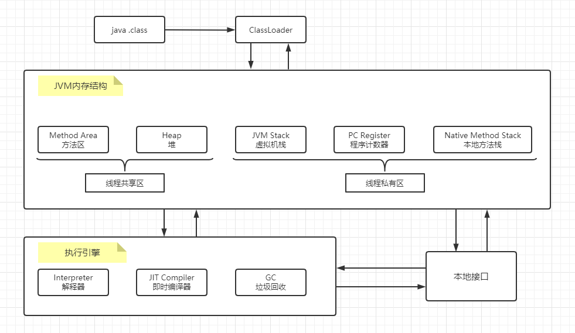
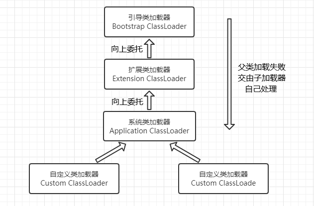
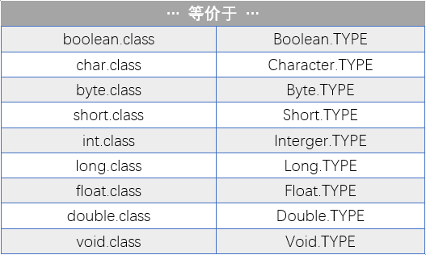
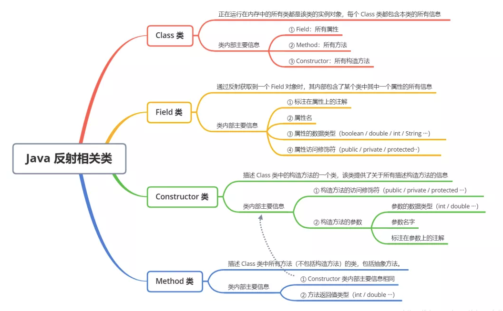

### 类加载器 —— ClassLoader

​	每个编写的 .java 文件都存储着需要执行的程序逻辑，这些 .java 文件经过java编译器编译为 .class 文件。此时这些 .class 文件中保存着 java 代码经过转换后的虚拟机指令。当需要使用某个类的时候，虚拟机便会加载它的 .class 文件，并创建对应的 Class 对象。
1、什么是类加载？
​		将 class 文件加载到虚拟机内存，这个过程成为类加载。

2、什么是类加载器？
		类加载器是Java运行时环境的一部分，负责动态加载Java类到Java虚拟机的内存中。类通常是按需加载，即第一次使用该类时才加载。



​																									JVM 与 类加载器

#### 类加载的过程

​	**加载**：通过一个类的全限定类名找到此类的字节码文件，并利用字节码文件创建一个 Class 对象。

​	**验证**：目的在于确保 class 文件的字节流中包含信息符合当前虚拟机要求，不会危害虚拟机自身安全。主要包括四种验证，文件格式验证，元数据验证，字节码验证，符号引用验证。

​	**准备**：为**类变量**（即 `static` 修饰的静态成员变量）分配内存并设置该类变量初始值为 0 。（比如  `static int i = 5;` 这里只将 i 的值设为 0。至于 5 的值，将在初始化阶段二次赋值。） 注意，① 这里不包含用 `final` 修饰的 `static`，若为 `static final int i = 5`，a 此时在准备阶段就会赋值 5 了；② 这里也不会为 **实例变量** （又称为成员变量，非静态成员变量）分配初始化，因为**类变量是分配在方法区，而实例变量会随着对象创建时一起分配到堆中**。

​	**解析**：主要将常量池中的**符号引用**替换为**直接引用**的过程。（符号引用就是用一组符号来描述目标，可以是任何字面量，比如变量名方法名等。直接引用就是直接指向目标的指针，相对偏移量，也就是直接指向内存的地址。）所涉及的解析：类或接口解析，字段解析，类方法解析，接口方法解析等。如需更详细了解，可参考《深入Java虚拟机》

​	**初始化**：类加载的最后阶段。**当初始化一个类的时候，如果发现其父类没有进行过初始化，则首先触发父类初始化。**然后：执行静态初始化器（又称：静态初始化块）与 类变量的二次赋值

​									

​																					类的加载过程

​	以上便是类加载的五个过程。而 类加载器 的任务，便是根据一个类的全限定类名读取此类的二进制字节流到 JVM 中，并生成一个与目标类对应的 `java.lang.Class` 对象实例。

​	虚拟机提供了 3 种类加载器：引导（Bootstrap）类加载器、扩展（Extension）类加载器、系统（System）类加载器（也称应用类加载器），下面分别介绍：


（1）启动类加载器（Bootstrap ClassLoader）

​	这个类加载器负责加载存放在 `JAVA_HOME/lib` 下的核心类库，或者把 `-Xbootclasspath` 参数所指定路径中的 jar 包加载到内存中，并且是虚拟机识别的类库加载到虚拟机内存中。启动类加载器无法被Java程序直接引用。这个类加载器是用 C++ 语言实现的。

（2）扩展类加载器（Extension ClassLoader）

​	这个加载器负责加载 `JAVA_HOME/lib/ext` 目录中的，或者被 `java.ext.dirs` 系统变量所指定的路径中的所有类库，开发者可以直接使用扩展类加载器。这个类加载器即 `sun.misc.Launcher.ExtClassLoader`类，java 语言实现。

（3）应用类加载器（Application ClassLoader）

​	这个加载器是 `ClassLoader.getSystemClassLoader()` 方法的返回值，所以一般也称它为系统类加载器。它负责加载用户类路径（Classpath）上所指定的类库，可直接使用这个加载器，如果应用程序没有自定义自己的类加载器，一般情况下这个就是程序中默认的类加载器。这个类加载器即 `sun.misc.Launcher.AppClassLoader`类，java 语言实现。

#### 双亲委派模式

##### 双亲委派模式工作原理

​	双亲委派模式要求：除了顶层的启动类加载器外，其余的类加载器都应当有自己的父类加载器，请注意双亲委派模式中的父子关系并非通常所说的类继承关系，而是采用组合关系来复用父类加载器的相关代码。
​	双亲委派模式是在 Java 1.2 后引入的。其工作原理是，如果一个类加载器收到了类加载请求，它并不会自己先去加载，而是把这个请求委托给父类加载器，如果父类加载器还存在其父类加载器，则进一步向上委托，直到请求到达顶层的**启动类加载器**。 若父类加载器可以完成加载任务，就成功返回；如果父类加载器无法完成加载请求（它的搜索范围中没有找到所需加载的类），则子类加载器自己尝试加载。这就是双亲委派模式。
​	即每个儿子都很懒，每次有活就丢给父亲去干，直到父亲说这件事我也干不了时，儿子自己想办法去完成。

##### 双亲委派模式的优势

​	采用双亲委派模式的好处是，Java 类会随着它的类加载器一起具备了 **一种带有优先级的层次关系**。
​	① 通过这种层级关系可以避免类的重复加载：父类加载器加载过，子类就不会再加载一次。JVM 判断两个类是否相同，不仅仅要求类的全名是否相同，还必须看它们的类加载器是否一样。
​	②考虑到安全因素，为了保证 Java 的核心 API 不会被随意替换。假设通过网络传递一个名为`java.lang.Integer`的类，类加载请求通过双亲委托模式传递到了顶层启动类加载器，而启动类加载器在核心 Java API 发现了这个名字的类，且该类已被加载，并不会重新加载网络传递的过来的`java.lang.Integer`，而直接返回已加载过的`Integer.class`，这样便可以防止核心API库被随意篡改。可能你会想，如果我们在 classpath路径下自定义一个名为`java.lang.SingleInterge`的类呢(该类是胡编的)？该类并不存在 java.lang 中，经过双亲委托模式，传递到启动类加载器中，由于父类加载器路径下并没有该类，所以不会加载，将反向委托给子类加载器加载，最终会通过系统类加载器加载该类。但是这样做是不允许，因为java.lang是核心API包，需要访问权限，强制加载将会报出如下异常
`java.lang.SecurityException: Prohibited package name: java.lang`

#### 类加载器的层次结构




### Java 的反射

#### java 中的对象

​	java 是面向对象的语言，虽然常说 java 中一切皆对象，但也有一些不是对象，比如：8种基本类型，类变量等。

​	在 Java 中即使是类，也是对象，**所有的类都是 `java.lang.Class` 类的实例对象。**

#### Class 对象是什么

​	我们知道类加载的时候，.class 文件被加载到虚拟机内存时，类加载器还会调用 ClassLoader 类的 `defineClass()` 方法，将字节流解析为 JVM 能够识别的 Class 对象。那么为什么需要这样一个 Class 对象呢？实际上 Class 对象里面含有对应 java 类的相关类型信息，因为在 Java 中我们并不能在编译的时候就得知所有类的类型信息，有些类型信息只有在运行时才能知道。

​	在运行时再确定类型信息，这就是 RTTI（Run-Time Type Idetification）。
​		① 传统 RTTI 的说法来自于C++，C++是静态类型语言，其数据类型 必须 在编译阶段就确定好，不能在运行时更改。至于C++怎么实现RTTI 的，详情自己百度。
​		② Java 实现 RTTI，是反射机制。通过反射机制来在运行时获取类型信息（接口，父类，属性，方法等都能拿到）。

#### Class 对象在哪里

​	Java 中每个类都有它对应的 Class 对象。实际上，每当我们编译一个新创建的类就会产生一个对应的 Class 对象，并且这个 Class 对象就保存在同名的 .class 文件中（其实编译后的 .class 文件保存的就是 Class 对象）

​	.class 文件，也就是字节码文件，里面存储的是16进制的字节码，但这个文件是二进制的文件。
​	字节码文件的开头 是占4个字节的魔数 CAFE BABE，Java的 logo 就是咖啡，魔数是区分文件类型的标志，写在文件内部是为了安全。字节码文件深入了解请百度。

#### Class 对象的创建

​	Class 类只有私有构造函数，所以 Class 对象只能够由 JVM 创建和加载。

​	java 类编译后只会创建一个 Class 对象。不管 java 类它自己有多少个实例对象，但只有一个 Class 对象，包含有类的类型信息。

#### Class 对象的加载

​	所有的类都是在对其第一次使用的时候，动态加载到 JVM 中的。当程序创建第一个对类的静态成员的引用时（**排除class.forName情况**），就会加载这个类。（在类中，用 static 声明的成员变量成为静态成员变量，用 static 声明的方法即称为静态方法。统称静态成员）

注意：

​	① 这也证明了**构造器也是类的静态方法**。即使在构造器之前并没有使用static关键字。因此，当我们使用 new 创建对象时，实际上也是对类静态成员的引用。这也从侧面说明了构造器为什么不能够被继承。

​	② 类加载时，假如有父类还未加载初始化，先加载初始化 其父类！

​	Java 程序并不是在开始运行前就把所有类都加载到内存，而是按需加载。当要使用该类时，类加载器会先检查该类的 Class 对象是否已经被加载了，如果没加载过，就动态加载到内存中。

#### Class 对象的获取

我们知道 Class 类的构造函数声明是 private，是私有的，所以是不能new的。Class对象只能由虚拟机创建。

对于任何一个类，既 Class 类的实例对象，有三种获取方法：

```java
//我们用Foo代表一个普遍的类，并创建它的实例对象foo
Foo foo = new Foo();

1) Class c1 = Class.forName("全限定类名")；
    //要抛出ClassNotFoundException异常，不抛出就要try catch。这种方式的好处是无需持有实例对象就能获取Class对象
    
2) Class c2 = foo.getClass();
    //注意：getClass()方法是从顶级类 Object 类继承而来的
```

3）使用 **类字面常量** 创建 Class 对象

```java
//类名: ClassInitialization.java
import java.util.*;

class Initable {
    static final int staticFianl = 47;  //这是编译期常量
    static final int staticFianl2 = ClassInitialization.rand.nextInt(1000);		//（非常数静态域）这是运行期常量
    static {
        System.out.println("初始化类Initable，执行类的静态初始化块");
    }
}

class Initable2{
    static int staticNonFianl = 147;
    static {
        System.out.println("初始化类Initable2，执行类的静态初始化块");
    }
}

class Initable3{
    static int staticNonFianl = 74;
    static {
        System.out.println("初始化类Initable3，执行类的静态初始化块");
    }
}


public class ClassInitialization {
    public static Random rand = new Random(47);     //使用含参构造函数，指定seed

    public static void main(String[] args) throws Exception{    //forName()方法会抛出异常
        Class initable = Initable.class;
        System.out.println("After creating Initable reference");
        // ↑ 因为使用类字面常量创建Class对象，所以此时还未触发类的初始化
        System.out.println(Initable.staticFianl);
        // ↑ 此时也未触发类的初始化，因为 staticFianl 的值编译时就确定了，不需要初始化类就能拿到
        System.out.println(Initable.staticFianl2);
        // ↑ 此时才初始化了类，因为staticFianl2的要计算，并没有在编译期就确定值，而是运行时才能确定值。

        System.out.println(Initable2.staticNonFianl);
        //第一次对类的静态成员引用，触发了类的初始化（非final常量）

        Class initable3 = Class.forName("com.company.Initable3");
        //forName()创建Class对象的时候就会初始化，并不会延迟到对类静态成员第一次引用时才初始化
        System.out.println("After creating Initable3 reference");
        System.out.println(Initable3.staticNonFianl);
    }

}
//通过 类字面常量方法 获取。这实际上是在告诉我们，任何一个类都有一个隐藏的静态成员变量class
//这种方式比前两种方法更加简单，高效，安全。
//因为根除了对forName()方法的调用，可以延迟初始化类，所以更高效；
//因为它在编译期就会受到检查，（所以不必放入try catch中）所以更安全。
```

运行结果：

```
After creating Initable reference
47
初始化类Initable，执行类的静态初始化块
258
初始化类Initable2，执行类的静态初始化块
147
初始化类Initable3，执行类的静态初始化块
After creating Initable3 reference
74
```

注意，有一点很有趣，当使用 '.class' 创建对 Class 对象的引用时，不会自动的初始化该 Class 对象。也就是说，这句代码：`Class initable = Initable.class` 只创建了一个 reference，并没有对类初始化。

初始化被延迟到了对 **静态成员** 或者 **非常数静态域** 进行首次引用时才执行。

而且，类字面常量不仅仅可以应用于普通的类，还可以应用于接口，数组以及基本数据类型。另外，对于基本数据类型的包装器类，它有一个标准字段 `TYPE`。这个 `TYPE` 字段就是一个引用，指向对应的**基本数据类型的 Class 对象**。所以，以下写法是等价的：



一般情况下，更倾向使用 .class 方式，这样可以保持与普通类的形式统一。

**但注意：**`int.class` 与 `Integer.TYPE`是等价的，但是与`Integer.class`并不等价。前两个均表示 `int` 的 Class 对象，而后者表示 `Integer` 的Class对象。（之前说过，8 种基本类型虽然不是对象，但是有 9 个预先定义好的 Class 对象代表 8 种基本类型和 void。它们由 java 虚拟机创建，并且可以通过 `java.lang.Boolean.TYPE`... 这种方式来获取。） 


Void 类是 void 关键字的包装类，位于 `java.lang.Void`。简单介绍 Void：
① 通过反射获取返回值为 void 的方法

```java
public class Test {
  public void hello() {}
  public static void main(String args[]){
    for(Method method : Test.class.getMethods()) {
      if(method.getReturnType().equals(Void.TYPE)) {
        System.out.println(method.getName());
      }
    }
  }
}
```

② 应用在泛型中，如`class<Void>`


#### 为 Class 引用添加泛型约束

```java
//没有泛型
Class intClass = int.class;

//带泛型的Class对象
Class<Integer> integerClass = int.class;	//Integer 类型的 Class 引用指向 int 的 Class 对象
integerClass = Integer.class;

//没有泛型的约束,可以随意赋值
intClass= double.class;

//编译期就会报错,无法编译通过
integerClass = double.class
```

从以上代码可以看出，声明一个普通不带泛型的 Class 对象，在编译期就不会检查 Class 对象的确切类型是否要求，如果有错误只有在运行期才可以暴露出来。但是通过**泛型声明**指明类型的 Class 引用，在编译期就会对 Class 对象进行额外的类型校验检查，确保在编译期就能保证类型的正确性。

```java
Class<?> intClass = int.class;
intClass= double.class;
```

① 告诉编译器，我确实要采用任意类型的泛型，而非忘记了使用泛型约束。
② 这样做，至少不会在编译器检查时产生警告信息。
因此，`Class<?>` 总是优先于直接使用`Class`

```java
//Number类是 java.lang 包下的一个抽象类，提供了将包装类型拆箱成基本类型的方法，其中几个数据类型（int，double等）的包装类型都继承了该抽象类，并且是final声明不可继承改变；

//编译无法通过
Class<Number> numberClass = Integer.class;

//编译通过
Class<? extends Number> childClass = Integer.class;
//赋予其他类型也行
childClass = double.class;
childClass = Number.class;
```

最后，extends 关键字的作用是告诉编译器，只要是 Number 的子类都可以。

#### 反射的详细介绍

Java 反射主要由 4 部分组成：

**Class **：任何运行在内存中的类，都是 Class 类的实例对象，每个 Class 对象都包含着本类的所有信息。主要包括 Filed, Method, Constructor。

**Filed** ：描述一个类的属性，它包含该属性的所有信息，如：属性名，数据类型，访问修饰符等...

**Method** : 描述一个类的方法，它包含该方法的所有信息，如：方法名，返回值类型，参数名，参数类型，访问修饰符等...

**Constructor** ：描述一个类的构造法，类似 Method，但是它没有 返回值类型。



#### 构造 类的实例化对象

也就是说，通过 Class 对象获取对应类的实例对象。

① 使用 Class 对象的 `newInstance()`方法来创建 Class 对象对应类的实例。
② 先通过 Class 对象获取指定的 Constructor 对象，再调用 Constructor 对象的 `newInstance()`方法来创建实例。

```java
// 1、Class 对象调用newInstance()方法
Class<Employee> clazz = Employee.class;
Employee employee = (Employee) clazz.newInstance();

// 2、Constructor 构造器调用newInstance()方法
Constructor<?> constructor = clazz.getConstructor(String.class, String.class, String.class, int.class, String.class, int.class);
Employee employee1 = clazz.cast(constructor.newInstance("", "", "", 1, "", 1));  
//cast()方法的作用就是强转类型，clazz是Employee类型，所以强转为Employee类型。
```

注：通过 Class 对象调用 newInstance() 默认走无参构造方法，如果想通过任意构造方法创建实例，先从 Class 中调用`getConstructor()`方法获取对应的构造器，再通过构造器去实例化对象。


#### 获取一个类的所有信息

##### Constructor 类

Class 类中和 Constructor 类相关的主要方法：

| 返回值           | 方法名称                                       | 方法说明                                                 |
| ---------------- | ---------------------------------------------- | -------------------------------------------------------- |
| Constuctor<?>[ ] | getConstructors()                              | 获取类中所有被public修饰的构造器                         |
| Constructor< T > | getConstructor(Class<?>... paramTypes) | 根据参数类型获取类中某个构造器，被public修饰的构造器 |
| Constructor<?>[ ] | getDeclaredConstructors()                      | 获取类中所有构造器（包括private）                        |
| Constructor< T > | getDeclaredConstructor(Class<?>... paramTypes) | 根据参数类型获取对应的构造器（包括private）                  |

Constructor 类中的常用方法：

| 返回值      | 方法名称                        | 方法说明                                          |
| ----------- | ------------------------------- | ------------------------------------------------- |
| Class< T >  | getDeclaringClass()             | 返回由该构造器声明的 Class 对象                   |
| Type[ ]     | getGenericParameterTypes()      | 按序返回构造器中形参的 Type 对象                  |
| String      | getName()                       | 以字符串形式返回此构造方法的名称                  |
| Class<?>[ ] | getParameterTypes()             | 按序返回构造器中形参的 Class 对象                 |
| T           | newInstance(Object... initargs) | 使用此 Constructor对象表示的构造函数来创建新实例  |
| String      | toGenericString()               | 返回描述此 Constructor 的字符串，其中包括类型参数 |

Type 是所有类型的高级公共接口，包括原始类型、参数化类型、数组类型、类型变量和基本类型。

`getGenericParameterTypes()` 和 `getParameterTypes()`：
	①如果方法参数不是参数化类型（即泛型），那么`getParameterTypes`和`getGenericParameterTypes`返回的结果是一样的。
	②如果方法参数是泛型，这时就有区别了，`getGenericParameterTypes`会返回完整的信息，而`getParameterTypes`只会返回参数类型，参数化类型无法得到。

##### Method 类

Class 类中和 Method 类相关的主要方法：

| 返回值    | 方法名称                                                   | 方法说明                                               |
| --------- | ---------------------------------------------------------- | ------------------------------------------------------ |
| Method    | getDeclaredMethod(String name, Class<?>... parameterTypes) | 根据名字和参数类型获取对应方法，无法获取继承下来的方法 |
| Method[ ] | getDeclaredMethod()                                        | 获取所有方法，但无法获取继承下来的方法                 |
| Method    | getMethod(String name, Class<?>... parameterTypes)         | 根据名字和参数类型获取对应方法，被public修饰的         |
| Method[ ] | getMethods()                                               | 获取类中被public修饰的所有方法                         |

Method  类中的常用方法：

| 返回值      | 方法名称                           | 方法说明                                                     |
| ----------- | ---------------------------------- | :----------------------------------------------------------- |
| Object      | invoke(Object obj, Object... args) | 参数1指定调用该方法的**对象**，如果是static修饰的类方法，则传null即可,<br />参数2是方法的参数列表值。 |
| Class<?>    | getReturnType()                    | 方法的返回Class类型                                          |
| Type        | getGenericReturnType()             | 方法的返回Type类型                                           |
| Class<?>[ ] | getParameterTypes()                |                                                              |
| Type[ ]     | getGenericParameterTypes()         |                                                              |
| String      | getName()                          | 方法名称                                                     |
| boolean     | isVarArgs()                        | 判断方法是否带可变参数                                       |
| String      | toGenericString()                  | 返回描述此 Method 的字符串，包括类型参数。                   |

##### Field 类

Class 类中和 Field 类相关的主要方法：

| 返回值   | 方法名称                      | 方法说明                                           |
| -------- | ----------------------------- | -------------------------------------------------- |
| Field[ ] | getFields()                   | 获取类中所有被public修饰的所有变量, 包含继承字段   |
| Field    | getField(String name)         | 根据变量名获取类中的一个变量，被public修饰的       |
| Field[ ] | getDeclaredFields()           | 获取类中所有的变量，但无法获取继承下来的变量       |
| Field    | getDeclaredField(String name) | 根据姓名获取类中的某个变量，无法获取继承下来的变量 |

Field 类中的常用方法：

| 返回值   | 方法名称                      | 方法说明                                                     |
| -------- | ----------------------------- | ------------------------------------------------------------ |
| void     | set(Object obj, Object value) | 将字段设置为指定的新值。                                     |
| Object   | get(Object obj)               | 返回指定对象上, 字段的值                                     |
| Class<?> | getType()                     | 返回一个 Class 对象，它标识了此Field 对象所表示字段的声明类型。 |
| boolean  | isEnumConstant()              | 如果此字段表示枚举类型的元素则返回 true；否则返回 false      |
| String   | toGenericString()             | 返回一个描述此 Field（包括其一般类型）的字符串               |
| String   | getName()                     | 返回字段的名称                                               |
| Class<?> | getDeclaringClass()           | 返回声明Field的类或接口的 Class 对象                         |
| void     | setAccessible(boolean flag)   | 将此对象的 accessible 标志设置为指示的布尔值,即设置其可访问性 |

**`getXXX()` 方法中，有无 Declared 的区别：**
	**有Declared修饰的方法：可以获取该类内部包含的所有变量、方法和构造器，但是无法获取继承下来的信息；**
	**无Declared修饰的方法：可以获取该类中public修饰的变量、方法和构造器，可获取继承下来的信息。**

如果想获取类中所有的(包括继承的)变量、方法和构造器，则需要同时调用getXXXs()和getDeclaredXXXs()两个方法，用Set集合存储它们获得的变量、构造器和方法，以防两个方法获取到相同的东西。
如果父类的属性用protected修饰，利用反射是无法获取到的。


##### 反射包中的 Array 类

​	这里的是 java.lang.reflect.Array ，不同于平常使用的 java.util.Arrays 工具类。


