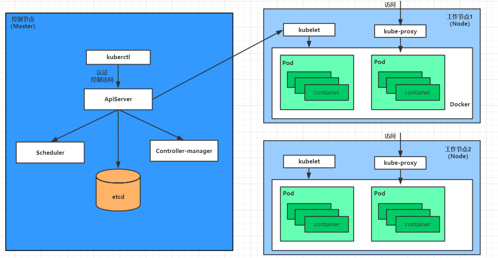

## 一、Kubernetes 简介

## 二、Kubernetes组件

一个 Kubernetes 集群主要是由 控制节点 —— master ，工作节点 —— node 构成的。每个节点上会安装不同的组件

master：集群的控制平面，负责集群的决策（负责集群的管理）

> ApiServer：资源操作的唯一入口，用于接收用户的输入命令，提供认证，授权，API注册和发现等机制。
>
> Scheduler：负责集群资源的调度，按照预定的调度策略将 Pod 调度到相应的 node 节点上。
>
> ControllerManager：负责维护集群的状态，比如程序部署安排，故障检测，自动扩展，滚动更新等。
>
> Etcd：负责存储集群中各种资源对象的信息。

node：集群的数据平面，负责为容器提供运行环境（负责干活的）

> Kubelet：负责维护容器的生命周期，既通过控制 Docker 来创建，更新，销毁容器。
>
> KubeProxy：负责提供集群内的服务发现和负载均衡
>
> Docker：负责节点上容器的各种操作

下面，以部署一个 nginx 服务来说明 Kubernetes 系统各个组件之间的调用关系：

1、Kubernetes 环境启动之后，首先存储 master 和 node 的自身信息到 etcd 数据库中。

2、一个 nginx 服务的安装请求，首先发送到 master 节点的 ApiServer 组件

3、APIServer 组件调用 Scheduler 组件来计算，决定最后应该把这个服务安装到哪个 node 节点上。

4、ApiServer 调用 ControllerManager 去执行这个安装任务。

5、kubelet 接收到指令以后，会通知 docker，由 docker 来启动一个 nginx 的 Pod。

6、一个 nginx 服务运行了，要访问 nginx 服务通过 kube-proxy 来对 Pod 代理访问。

## 三、Kubernetes 中的概念

Master：控制节点，每个集群至少需要一个 master 节点来管控集群

Node：工作负载节点，由 master 来负责分配 Pod 到各个 node 上，一个 node 上能创建多少个 pod 取决于：

​			1、kubelet 启动的时候有没有指定 --max-pods
​			2、取决于 node 的 cpu, ram, 和你要创建的 pod request 的 cpu 和 ram

Pod：Pod 是 Kubernetes 最小操作单元，容器运行在 Pod 中，一个 Pod 可以包含多个 容器。

Controller：控制器（一类概念，有多种控制器），通过它来实现对 Pod 的管理，比如启动，停止，伸缩等等

Service：Pod 对外服务的统一入口，一个 Service 下面可以维护同一类的多个 Pod

Label：标签，对 Pod 进行分类，同一类 Pod 拥有相同的标签。Label还可以给 Pod 以外的其他东西打标签

NameSpace：命名空间，隔离 Pod 之间的运行环境

