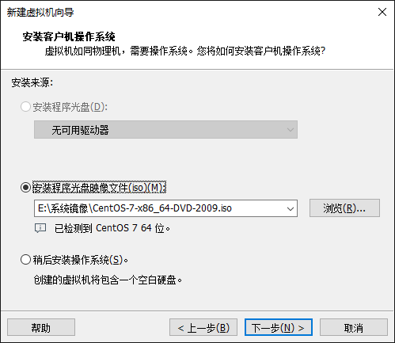
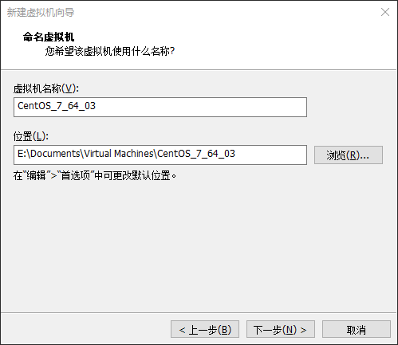
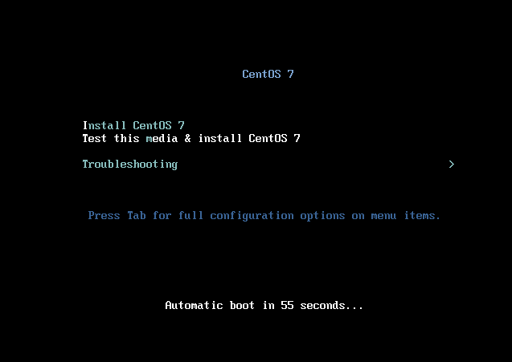
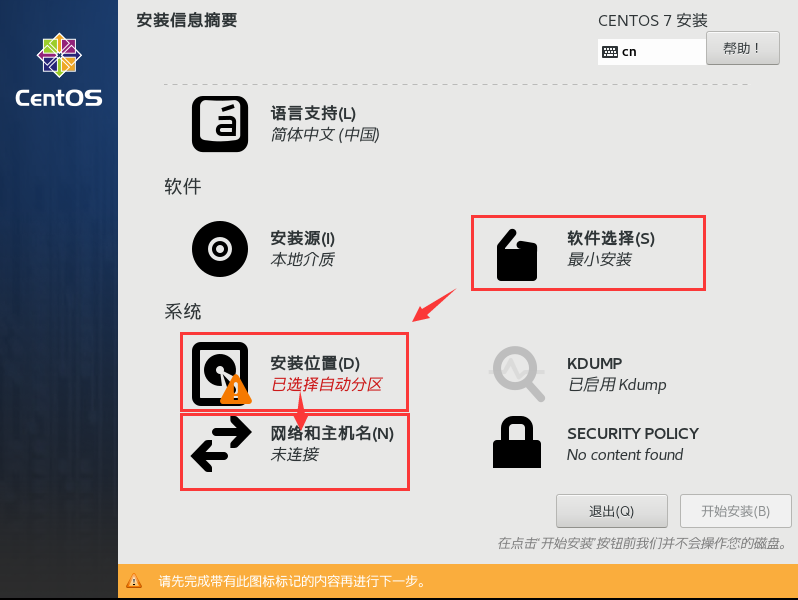
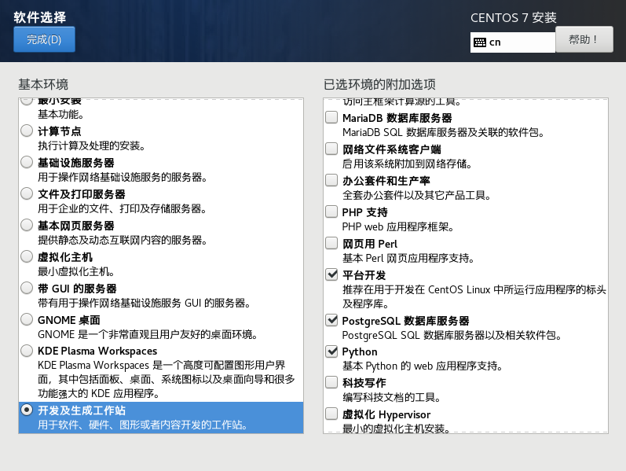
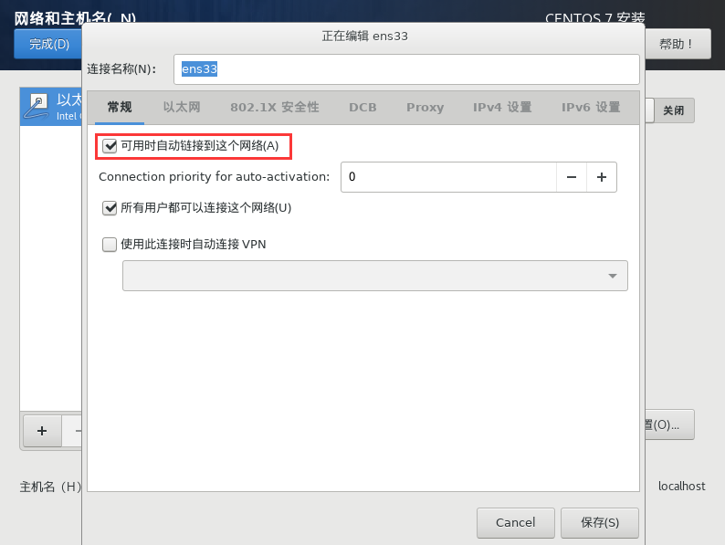
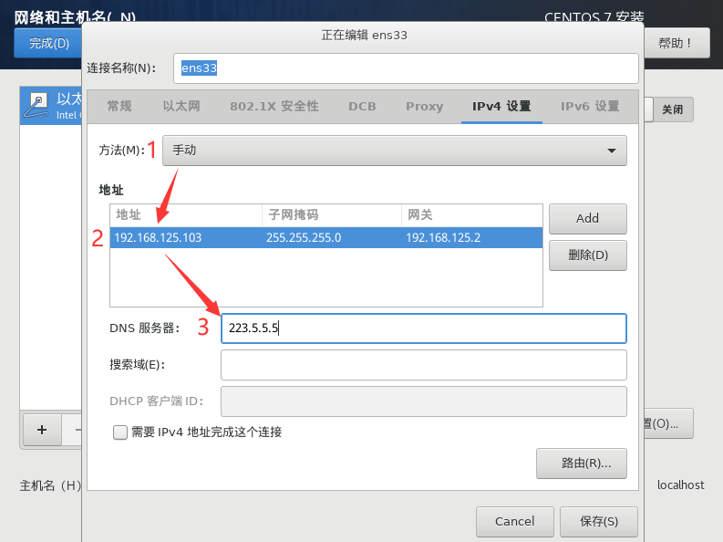
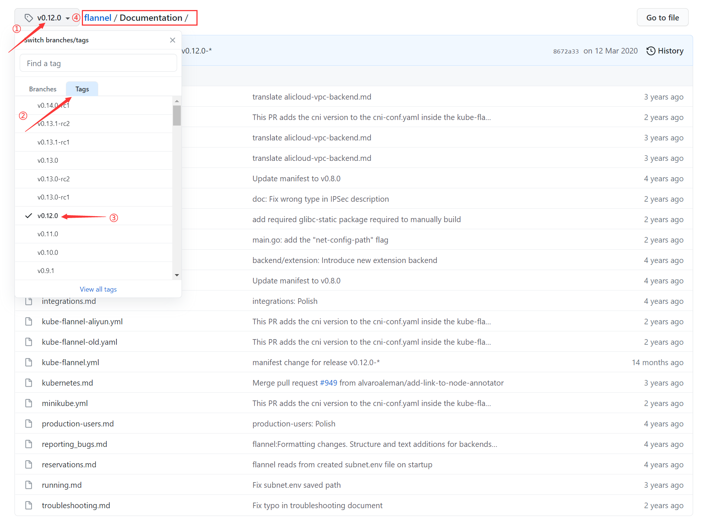

## 环境规划

### 集群类型

Kubernetes 集群大体上分为两类：**一主多从** 和 **多主多从**

一主多从：一个 master 和多个 node，搭建简单，但是有单机故障风险，适合测试环境

多主多从：多个 master 和多个 node，搭建麻烦，但是安全性高，适合于生产环境

> 方便起见，本次学习搭建 一主两从 的集群。

### 安装方式

Kubernetes 有多种部署方式，本次采用 kubeadm 工具快速搭建 k8s 集群，其他方式请百度。

### 主机规划

| 作用   | IP地址          | 操作系统  | 配置                     |
| ------ | --------------- | --------- | ------------------------ |
| Master | 192.168.125.100 | Centos7.9 | 2颗CPU  2G内存   50G硬盘 |
| Node1  | 192.168.125.101 | Centos7.9 | 2颗CPU  2G内存   50G硬盘 |
| Node2  | 192.168.125.102 | Centos7.9 | 2颗CPU  2G内存   50G硬盘 |

​		本次环境搭建需要三台 CentOS 服务器，一主二从，然后再每台服务器中分别安装 Docker，Kubeadm（1.17.4），kubelet（1.17.4），kubectl（1.17.4）。

## 环境搭建

### Linux 虚拟机安装

1、选择新建虚拟机后，直接选择镜像iso，不需要选择稍后安装系统：



2、注意给虚拟机重命名，和选择好安装位置：



3、需要选择CPU（2C），内存（2G），硬盘（50G）。其他步骤都点下一步。

4、进入系统安装界面后，第一行表示直接安装，第二行表示验证并安装。选择默认第二个选项。



5、语言选中文简体，然后需要设置以下选项：



6、软件选择：开发及生成工作站（有UI界面），或者基础设施服务器也可以。



7、安装位置点进去确定一下出来就可以了，网络和主机名配置以下两个页面：





8、开始安装，然后设置下 root 用户密码即可完成安装。

### 环境初始化

1、检查操作系统版本

```powershell
# 此方式下安装kubernetes集群要求Centos版本要在7.5或之上
[root@master ~]# cat /etc/redhat-release
CentOS Linux release 7.5.1804 (Core)
```

2、主机名解析

为了方便后面集群节点间的直接调用，在这配置一下主机名解析，企业中推荐使用内部DNS服务器。

```powershell
# 主机名成解析 编辑三台服务器的/etc/hosts文件，添加下面内容
192.168.125.100  master
192.168.125.101  node1
192.168.125.102  node2
```

3、时间同步

kubernetes要求集群中的节点时间必须精确一致，企业中建议配置内部的时间同步服务器。

```powershell
# 一：这里直接使用chronyd服务从网络同步时间。
# 启动chronyd服务
[root@master ~]# systemctl start chronyd
# 设置chronyd服务开机自启
[root@master ~]# systemctl enable chronyd
# chronyd服务启动稍等几秒钟，就可以使用date命令验证时间了
[root@master ~]# date
```

```powershell
# 二：调整系统时区
#设置系统时区为  中国/上海
timedatectl set-timezone Asia/Shanghai
# 将当前的TTC时间写入硬件时钟
timedatectl set-local-rtc 0
#重启依赖于系统时间的服务
systemctl  restart rsyslog && systemctl  restart crond
```

4、禁用防火墙 firewalld 和 iptablers

kubernetes 和 docker 在运行中会产生大量的 iptables 规则，为了不让系统规则跟它们混淆，直接关闭系统的规则。

企业中就不能随便关闭防火墙了！要自己理清楚 K8S 会产生那些 iptables 规则了。

```powershell
# 1 关闭firewalld服务
[root@master ~]# systemctl stop firewalld.service
[root@master ~]# systemctl disable firewalld.service
# 2 关闭iptables服务，虚拟机好像没有这个服务
[root@master ~]# systemctl stop iptables
[root@master ~]# systemctl disable iptables
```

5、禁用 selinux

selinux 是 linux 系统下的一个安全服务，如果不关闭它，在安装集群中会产生各种各样的奇葩问题。关闭它是因为它在本来已经很安全的 Linux上，凌驾于 root 权限之上，设置了很多额外的条条框框；如果你了解这些条条框框，那还好；但如果不了解，那selinux可能并没有帮什么忙，却给你带来了很多不确定因素。

```powershell
# 查看 selinux 状态，返回 Enforcing 表示开始
[root@master ~]# getenforce
Enforcing
# 方式一：临时关闭 selinux
[root@master ~]# setenforce 0

# 方式二：永久关闭
# 编辑 /etc/selinux/config 文件，修改SELINUX的值为disabled
# 注意修改完毕之后需要重启linux服务
SELINUX=disabled
```

6、禁用 swap 分区

swap 分区指的是虚拟内存分区，它的作用是在物理内存使用完之后，将磁盘空间虚拟成内存来使用；

启用 swap 设备会对系统的性能产生非常负面的影响，因此 kubernetes 要求每个节点都要禁用 swap 设备；

但是如果因为某些原因确实不能关闭 swap 分区，就需要在集群安装过程中通过明确的参数进行配置说明。

```powershell
# 方式一：临时关闭
[root@master ~]# swapoff -a

# 方式二：永久关闭
# 编辑分区配置文件/etc/fstab，注释掉swap分区一行
[root@master ~]# vim /etc/fstab

# fstab文件内容如下：
 UUID=455cc753-7a60-4c17-a424-7741728c44a1 /boot    xfs     defaults        0 0
 /dev/mapper/centos-home /home                      xfs     defaults        0 0
#/dev/mapper/centos-swap swap                       swap    defaults        0 0     <---注释掉这一行

# 注意修改完毕之后需要重启linux服务
```

7、调整系统内核参数

```powershell
# 修改linux的内核参数，添加地址转发功能

# 因网桥工作于数据链路层，数据默认会直接经过网桥转发，为避免 iptables 的 FORWARD设置 失效，需要启用bridge-nf机制
# 编辑/etc/sysctl.d/k8s.conf文件，添加如下配置:
net.bridge.bridge-nf-call-ip6tables = 1
net.bridge.bridge-nf-call-iptables = 1
net.ipv4.ip_forward = 1
vm.swappiness=0			# 禁止使用swap空间，只有当系统OOM时才允许使用它

# 重新加载配置
[root@master ~]# sysctl --system


####### 或可以参考K8S官网，执行以下命令： #######
# https://kubernetes.io/zh/docs/setup/production-environment/tools/kubeadm/install-kubeadm/ #
cat <<EOF | sudo tee /etc/sysctl.d/k8s.conf
net.bridge.bridge-nf-call-ip6tables = 1
net.bridge.bridge-nf-call-iptables = 1
EOF

sudo sysctl --system
####### ####### ####### ####### ####### #######
```

8、配置 ipvs 功能

在 Kubernetes 中 Service 有两种代理模型，一种是基于iptables的，一种是基于ipvs的。

两者比较的话，ipvs的性能明显要高一些，但是如果要使用它，需要手动载入ipvs模块。

```powershell
# 加载网桥过滤模块，允许 iptables 检查桥接流量，为了让你的 Linux 节点上的 iptables 能够正确地查看桥接流量，你需要确保在你的 sysctl 配置中将 net.bridge.bridge-nf-call-iptables 设置为 1
[root@master ~]# sudo modprobe br_netfilter

# 查看网桥过滤模块是否加载成功
[root@master ~]# lsmod | grep br_netfilter

# 参考K8S官网，执行以下命令，将上面的东西写到配置文件中：
cat <<EOF | sudo tee /etc/modules-load.d/k8s.conf
br_netfilter
EOF

# 1、安装ipset和ipvsadm
[root@master ~]# yum install ipset ipvsadmin -y

# 2、添加需要加载的模块写入脚本文件
[root@master ~]# cat > /etc/sysconfig/modules/ipvs.modules << EOF 
#!/bin/bash
modprobe -- ip_vs
modprobe -- ip_vs_rr
modprobe -- ip_vs_wrr
modprobe -- ip_vs_sh
modprobe -- nf_conntrack_ipv4
EOF

# 3、为脚本文件添加执行权限
[root@master ~]# chmod 755 /etc/sysconfig/modules/ipvs.modules

# 4、执行脚本文件
[root@master ~]# /bin/bash /etc/sysconfig/modules/ipvs.modules

# 5、查看对应的模块是否加载成功
[root@master ~]# lsmod | grep -e ip_vs -e nf_conntrack_ipv4
# grep -e XXX -e XXX 表示：使用grep -e 选项，只能传递一个参数，使用多个 -e 选项来实现 or操作。
```

9、重启服务器

重启完成后，检查下 selinux 和 swap 是否成功关闭了。

```powershell
[root@master ~]# reboot
```

### 安装 Docker

```powershell
# 第一步清除残留
$ sudo yum remove docker \
                  docker-client \
                  docker-client-latest \
                  docker-common \
                  docker-latest \
                  docker-latest-logrotate \
                  docker-logrotate \
                  docker-engine
                  
# 我这里是根据 Docker 官网方式安装：
# 在新主机上首次安装 Docker Engine-Community 之前，需要设置 Docker 仓库。之后，便可以从仓库安装和更新 Docker。
# 首先安装所需的软件包。yum-utils 提供了 yum-config-manager ，并且 device mapper 存储驱动程序需要 device-mapper-persistent-data 和 lvm2。
# 官方解释：Install the yum-utils package (which provides the yum-config-manager utility) and set up the stable repository.
$ sudo yum install -y yum-utils device-mapper-persistent-data lvm2


# 然后，使用以下命令来设置稳定的仓库。
# 下面的地址是官方提供的地址，下载速度慢，我们可以替换地址
$ sudo yum-config-manager \
    --add-repo \
    https://download.docker.com/linux/centos/docker-ce.repo
# 替换成阿里云的地址：
$ sudo yum-config-manager \
    --add-repo \
    http://mirrors.aliyun.com/docker-ce/linux/centos/docker-ce.repo

$ sudo yum makecache fast		#更新yum缓存


# 安装 Docker Engine-Community, 可以安装最新版或者指定版本
$ sudo yum install docker-ce docker-ce-cli containerd.io [-y]	#这个安装的全是最新版，可选参数 -y 表示安装时候自动选择yes！

$ yum list docker-ce --showduplicates | sort -r		#查看选择docker-ce各版本（比如 3:19.03.7-3.el7  :和-中间要掐头去尾!）
$ sudo yum install docker-ce-<VERSION_STRING> docker-ce-cli-<VERSION_STRING> containerd.io		#这个安装指定版本
$ sudo yum install docker-ce-18.06.3.ce docker-ce-cli-18.06.3.ce containerd.io		#比如我们安装


#启动 Docker，验证Docker
$ sudo systemctl start docker
$ sudo docker run hello-world
```

==以下步骤就是K8S集群环境搭建时，还需要继续配置的，Docker官网安装内容到这里就截止了==

```powershell
# Docker在默认情况下使用的Cgroup Driver为cgroupfs，而kubernetes推荐使用systemd来代替cgroupfs，这里就不深究为什么 K8S 这么推荐了，下面添加一个配置文件，就是为了做这个事情。
# 创建docker文件夹，并在下面配置叫 daemon 的配置文件：
$ mkdir  /etc/docker
$ tee /etc/docker/daemon.json <<-'EOF'
{
	"registry-mirrors": ["https://sx6un8wp.mirror.aliyuncs.com"],
	"exec-opts": ["native.cgroupdriver=systemd"]
}
EOF
# daemon 配置文件中，第一行是配置的阿里云镜像加速，这个是我自己的私人地址！！
# 第二行是systemd来代替cgroupfs
# 未添加的第三行 "insecure-registries": ["192.168.10.130:5000"]	//修改为registry所在容器的宿主机，大概是本地Docker镜像仓库的镜像地址，搭建私有镜像仓库用的。


# 创建存放docker的配置文件，这里是
$ mkdir -p /etc/systemd/system/docker.service.d

# 启动和设置自启
$ systemctl daemon-reload && systemctl restart docker && systemctl enable docker
$ docker version	#检查docker的状态和版本
```


### 安装 Kubernetes 组件

```powershell
# 1、设置 K8S 镜像源，位置在 /etc/yum.repos.d/kubernetes.repo 
# (1)、官方 yum 源：
cat <<EOF | sudo tee /etc/yum.repos.d/kubernetes.repo
[kubernetes]
name=Kubernetes
baseurl=https://packages.cloud.google.com/yum/repos/kubernetes-el7-\$basearch
enabled=1
gpgcheck=1
repo_gpgcheck=1
gpgkey=https://packages.cloud.google.com/yum/doc/yum-key.gpg https://packages.cloud.google.com/yum/doc/rpm-package-key.gpg
exclude=kubelet kubeadm kubectl
EOF

# (2)、阿里云 yum 源：
cat <<EOF > /etc/yum.repos.d/kubernetes.repo
[kubernetes]
name=Kubernetes
baseurl=http://mirrors.aliyun.com/kubernetes/yum/repos/kubernetes-el7-x86_64
enabled=1	
gpgcheck=0		# 网上有的博客这里等于 1，我觉得下面既然给了 key，这里应该打开验证，等于1是对的
repo_gpgcheck=0		# 网上有的博客这里等于 1，我觉得下面既然给了 key，这里应该打开验证，等于1是对的
gpgkey=http://mirrors.aliyun.com/kubernetes/yum/doc/yum-key.gpg
       http://mirrors.aliyun.com/kubernetes/yum/doc/rpm-package-key.gpg
EOF


# (3)、清华大学 yum 源：
cat <<EOF > /etc/yum.repos.d/kubernetes.repo
[kubernetes]
name=kubernetes
baseurl=https://mirrors.tuna.tsinghua.edu.cn/kubernetes/yum/repos/kubernetes-el7-$basearch
enabled=1
gpgcheck=0
EOF

#######################################################################################################################
enable = 1 		# 这个选项表示这个repo中定义的源是启用的，0为禁用
gpgcheck = 1 	# 这个选项有1和0两个选择，分别代表是否是否进行gpg(GNU Private Guard) 校验，以确定rpm包的来源是有效和安全的。
			   # 等于1表示这个repo中下载的rpm将进行gpg的校验，以确定rpm包的来源是有效和安全的。
gpgcheck = 0	# 等于0就好了，不用校验，清华大学yum源加上这个配置，不然提示公钥未安装。
gpgkey = XXXXXXX		# 定义用于校验的gpg密钥
#######################################################################################################################

# 2、安装指定版本 kubelet、kubeadm 和 kubectl
# 官网安装命令如下，excludes = ？表示yum安装或更新是排除？，而 disableexcludes 就表示不允许排除，这里表示不允许排除Kubernetes的组件！！这里安装的是最新版本。
sudo yum install -y kubelet kubeadm kubectl --disableexcludes=kubernetes

# 安装指定版本的 kubeadm，kubelet 和 kubectl：
# 这里使用的是清华大学的yum源，版本要和清华大学网站里面的版本对的上，$basearch的值可以通过 arch命令得知：x86_64
sudo yum install -y kubelet-1.17.4-0 kubeadm-1.17.4-0 kubectl-1.17.4-0
# Kubernetes 的历史发行版本号，可查官方文档：https://relnotes.k8s.io/


# 3、配置kubelet的cgroup
# 编辑 /etc/sysconfig/kubelet，添加下面的配置
# KUBELET_EXTRA_ARGS="--fail-swap-on=false" 一定要配置这一句，不然一直报错：The HTTP call equal to 'curl -sSL http://localhost:10248/healthz' failed with error，怎么都解决不了 ！！！
KUBELET_EXTRA_ARGS=--cgroup-driver=<systemd>
KUBELET_EXTRA_ARGS="--fail-swap-on=false"
KUBE_PROXY_MODE="ipvs"

# 4、启动kubelet服务
systemctl daemon-reload && systemctl start kubelet
# 5、设置开机自启
systemctl enable --now kubelet
```

任何时候，请习惯查阅官方文档，以上的配置是 1.19 版本的， 1.20及以上版本配置已经改了，下面是1.20版本的配置方法：

```powershell
# 请注意，你只需要在你的 cgroup 驱动程序不是 cgroupfs 时这么做， 因为它已经是 kubelet 中的默认值。但我们要配置 systemd！！
# 由于 kubelet 已经弃用了 --cgroup-driver 标志，如果你在配置文件 /etc/sysconfig/kubelet 包含此设置，请将其删除，并使用 KubeletConfiguration 作为替代（默认存储于 /var/lib/kubelet/config.yaml 文件中）。
# 因此，我们应该这么配 1.20版本：
cat > /var/lib/kubelet/config.yaml <<EOF
apiVersion: kubelet.config.k8s.io/v1beta1
kind: KubeletConfiguration
cgroupDriver: <systemd>
EOF
```


### 准备集群镜像

```powershell
# 在安装kubernetes集群之前，必须要提前准备好集群需要的镜像，所需镜像可以通过下面命令查看
[root@master ~]# kubeadm config images list

# 下载镜像
# 此镜像在kubernetes的仓库中,由于网络原因,无法连接，下面提供了一种替代方案
images=(
    kube-apiserver:v1.17.4
    kube-controller-manager:v1.17.4
    kube-scheduler:v1.17.4
    kube-proxy:v1.17.4
    pause:3.1
    etcd:3.4.3-0
    coredns:1.6.5
)

for imageName in ${images[@]} ; do
	docker pull registry.cn-hangzhou.aliyuncs.com/google_containers/$imageName
	docker tag registry.cn-hangzhou.aliyuncs.com/google_containers/$imageName k8s.gcr.io/$imageName
	docker rmi registry.cn-hangzhou.aliyuncs.com/google_containers/$imageName
done
```


### 集群初始化

下面开始对集群进行初始化，并将node节点加入到集群中

> **下面的操作只需要在`master`节点上执行即可**

```powershell
# 创建集群
kubeadm init \
	--kubernetes-version=v1.17.4 \
    --pod-network-cidr=10.244.0.0/16 \
    --service-cidr=10.96.0.0/12 \
    --apiserver-advertise-address=192.168.125.100
    
# 备注：init 或者将node节点加入集群时，kubeadm命令执行一次没成功，再次执行就会报错，reset一下kubeadm就好：
$ kubeadm reset		
# 该命令尽力还原由 kubeadm init 或 kubeadm join 所做的更改。
```

安装成功后提示如下：

```powershell
Your Kubernetes control-plane has initialized successfully!

To start using your cluster, you need to run the following as a regular user:

  mkdir -p $HOME/.kube
  sudo cp -i /etc/kubernetes/admin.conf $HOME/.kube/config
  sudo chown $(id -u):$(id -g) $HOME/.kube/config

You should now deploy a pod network to the cluster.
Run "kubectl apply -f [podnetwork].yaml" with one of the options listed at:
  https://kubernetes.io/docs/concepts/cluster-administration/addons/

Then you can join any number of worker nodes by running the following on each as root:

kubeadm join 192.168.125.100:6443 --token 0jxz01.2nn45uadtsrgy082 \
    --discovery-token-ca-cert-hash sha256:ced173322fa5e8e8d909c996fff51e0247f9c45409e4729e00a8f68823f63f5b
```

接着：

```powershell
# 创建必要文件
mkdir -p $HOME/.kube
sudo cp -i /etc/kubernetes/admin.conf $HOME/.kube/config
sudo chown $(id -u):$(id -g) $HOME/.kube/config
```


> **下面的操作只需要在`node`节点上执行即可**

```powershell
# 将node节点加入集群
# 可以看到，init成功后其实已经提示的很清楚了，原文：
# Then you can join any number of worker nodes by running the following on each as root:
# 接着你可以加入任何的工作节点，通过root权限运行下面的命令：
# kubeadm join 192.168.125.100:6443 --token 0jxz01.2nn45uadtsrgy082 \
#   --discovery-token-ca-cert-hash sha256:ced173322fa5e8e8d909c996fff51e0247f9c45409e4729e00a8f68823f63f5b
# （注意是在node节点上运行这个命令，哪个node节点运行了这个命令，哪个node节点就会被加入这个master节点下面）  
[root@master ~]# kubeadm join 192.168.125.100:6443 --token 0jxz01.2nn45uadtsrgy082 \
    --discovery-token-ca-cert-hash sha256:ced173322fa5e8e8d909c996fff51e0247f9c45409e4729e00a8f68823f63f5b
	
# 查看集群状态 此时的集群状态为NotReady，这是因为还没有配置网络插件，所以接下来就该配置网络插件了。
[root@master ~]# kubectl get nodes
NAME     STATUS     ROLES    AGE   VERSION
master   NotReady   master   18m   v1.17.4
node1    NotReady   <none>   75s   v1.17.4
node2    NotReady   <none>   67s   v1.17.4
```


### 安装网络插件

kubernetes支持多种网络插件，比如flannel、calico、canal等等，任选一种使用即可，本次选择flannel

> 下面操作依旧只在`master`节点执行即可，插件使用的是DaemonSet的控制器，它会在每个节点上都运行

总结来说：就两个步骤：

1. 获得`kube-flannel.yml` ；
2. `kubectl apply -f kube-flannel.yml` 执行 yml 文件

课件的方法是：通过这个 `wget https://raw.githubusercontent.com/coreos/flannel/master/Documentation/kube-flannel.yml` 获取到 yml，然后编辑文件 修改文件中 quay.io 仓库为 quay-mirror.qiniu.com。修改好后，上传到虚拟机后，直接拿来用。

但是不推荐：这个网址要翻墙，虚拟机下载不下来，本地下载了还要编辑，麻烦！quay.io 是RedHat的镜像库，要翻墙，虽然替换为七牛云公司的镜像库，但七牛云这个也没说长期维护，麻烦！

推荐安装 flannel 做法：

1、去 github 官网：https://github.com/flannel-io/flannel/releases 下载 0.12.0 或者 0.13.0 的官方 Docker 镜像文件，上传到linux服务器后：

```powershell
$ docker load < flanneld-v0.12.0-amd64.docker
$ docker images		# 此时可以发现docker本地镜像库中已经有images镜像文件了，就不会再去 quay.io 下载了
```

2、去官网下载对应版本的 kube-flannel.yml 文件，在 Documentation 文件夹下：



最后 apply yml配置文件：

```powershell
[root@master ~]# kubectl apply -f kube-flannel.yml

# 稍等约几分钟，不要急，再次查看集群节点的状态
[root@master ~]# kubectl get nodes
NAME     STATUS   ROLES    AGE     VERSION
master   Ready    master   9h      v1.17.4
node1    Ready    <none>   9h      v1.17.4
node2    Ready    <none>   9h      v1.17.4
```

## 环境测试

部署一个 nginx 服务测试下环境：

```powershell
# 部署nginx
[root@master ~]# kubectl create deployment nginx --image=nginx:1.14-alpine

# 暴露端口
[root@master ~]# kubectl expose deployment nginx --port=80 --type=NodePort

# 查看服务状态
[root@master ~]# kubectl get pods,svc
NAME                         READY   STATUS    RESTARTS   AGE
pod/nginx-6867cdf567-9dkpl   1/1     Running   0          25s

NAME                 TYPE        CLUSTER-IP     EXTERNAL-IP   PORT(S)        AGE
service/kubernetes   ClusterIP   10.96.0.1      <none>        443/TCP        11h
service/nginx        NodePort    10.110.206.7   <none>        80:31021/TCP   18s

# 4 最后在电脑上访问下部署的nginx服务
192.168.125.100:31021
```


