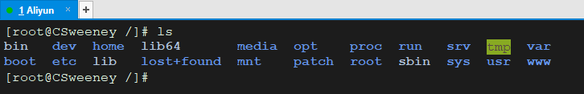

#### 认识 Linux

​	我们基于 Java 后端常用的 CentOS 7 学习。

​	==Linux 一切皆文件，主要操作就是关于文件的 读，写，（权限）==

#### 开机登录

开机会启动很多程序，在 windows 上叫做服务（Service），在 Linux 上叫做 “守护进程” （deamon）。

#### 关机

```shell
sync		#关机前先同步一次数据到硬盘		#Linux中没有提示错误就代表操作成功
shutdown	#关机
shutdown -h 10		#10分钟后关机
shutdown -r now		#立即重启
reboot		#重启
halt		#关闭系统，等于 shutdown -h now + poweoff
```

#### 系统的目录结构



- **/** ：系统根目录

- **/bin**：bin 是binary的缩写，这个目录存的是经常使用的命令文件。

- **/boot**：这里存放的是启动 Linux 时使用的一些核心文件，包括一些连接文件和镜像文件，尽量不要动。

- **/dev**：既 device 的缩写，存放了 Linux 的外部设备，在 Linux 中访问设备的方式和访问文件的方式是相同的。

- ==**/etc**：（et ceteta）这个目录用来存放所有的系统管理所需要的配置文件和子目录==

- ==**/home**：用户主目录，里面包括了各个用户的子目录。==
             如果是root用户，`cd ~` 相当于 `cd /root`。如果是普通用户，`cd ~` 相当于 `cd /home/当前用户名`

- **/lib**：Library(库) ，这里存系统最基本的动态连接共享库，类似于 windows 中的 dll 文件库。

- **/lost+found**：一般不使用该目录，该目录是当系统非法关机后，这里就会存放了一些文件。

- **/media**：linux 系统会自动识别一些设备，例如U盘、光驱等等，当识别后，Linux 会把识别的设备挂载到这个目录下。

- **/mnt**：挂在目录，可以将光驱之类的挂载在该目录下，然后进入该目录就能查看里面的内容了（后面也会把一些本地文件挂载在这里）。

- **/opt**：optional(可选)，这里主要存放那些可选的程序。你想尝试最新的firefox测试版吗?那就装到/opt目录下吧，这样，当你尝试完，想删掉  firefox的时候，你就可 以直接删除它，而不影响系统其他任何设置。安装到/opt目录下的程序，它所有的数据、库文件等等都是放在同个目录下面。

- **/proc**：Processes(进程) ，这个目录是一个虚拟的目录，它是系统内存的映射，我们可以通过直接访问这个目录来获取系统信息。这个目录的内容不是在硬盘上，而是在内存中，我们也可以修改里面的某些文件，如修改 `/proc/sys/net/ipv4/icmp_echo_ignore_all` 文件来屏蔽主机的ping命令，使别人无法ping你的机器：

  ```shell
  echo 1 > /proc/sys/net/ipv4/icmp_echo_ignore_all		#0表示响应请求，1表示忽略请求，这种方式只能临时禁止ping
  ```

- **/root**：为系统管理员，既超级权限者的用户主目录。

- **/sbin**：s：Super，是 Superuser Binaries (超级用户的二进制文件) 的缩写，这里存放的是系统管理员使用的系统管理程序。

- ==**/tmp**：temp，存一些临时文件，用完既丢，比如安装包。==

- ==**/usr**：系统级的目录，下面有很多子目录，可以理解为`C:/Windows/`。==

- **/usr/lib**：放库文件的，可以理解为`C:/Windows/System32`。

- **/usr/local**：用户级目录，类似 windows 的 program files。这里主要存放那些手动安装的软件， 即不是通过“新立得”或apt-get安装的软件。它和 /usr 目录具有相类似的目录结构。 让软件包管理器来管理/usr目录，而把自己用的软件放到/usr/local目录下面，这应该是个不错的主意。

- **/usr/src**：系统级的源码目录。
  **/usr/local/src**：用户级的源码目录。

- **/bin, /sbin, /usr/bin, /usr/sbin**：这是系统预设的执行文件的放置目录，比如 ls 就是在 /bin/ls 目录下的。

- ==**/var**：既variable，这个目录中存放着在不断扩充着的东西，我们习惯将那些经常被修改的目录放在这个目录下。包括各种日志文件。==

- ==**/www**：存放服务器网站的相关资源，项目。==


