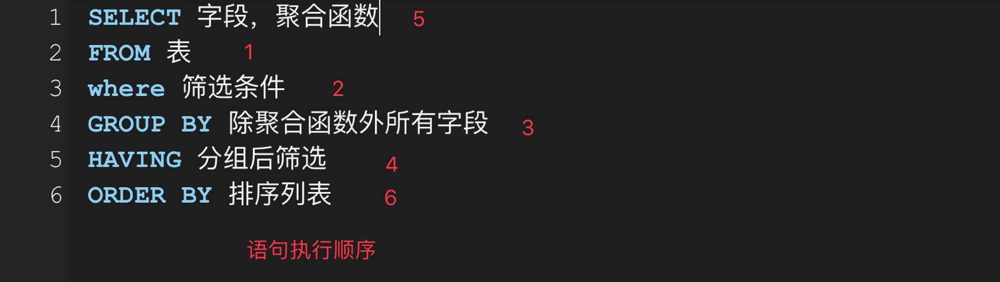

1、concat() 函数：用于拼接字符串

```mysql
select concat(firstname, lastname) as 姓名 from XXX
#注意：若参数中有一个为 null，则拼接而成的结果必定为 null。 为了避免这种情况，对可能为null的字段使用 ifnull() 函数。
#格式： ifnull(字段名称，替换值)
select concat(firstname, lastname, ifnull(allowance, 0)) as 姓名 from XXX
```


2、distinct 关键字用来去重


3、like关键字与通配符

```mysql
%  0个或多个字符
_  单个字符
#拓展：regexp 关键字表示正则匹配
select * from stu_info where name regexp '^[A-D]'   #选取名字以 A到D 开头的
select * from stu_info where name regexp '^[^A-D]'  #选取名字不是以 A到D 开头的
```


4、between and 关键字包含边界值

```mysql
scope between A and B 相当于 scope>=A and scope<=B
```


5、用 in 关键字代替多个 or条件语句

```mysql
scope in ('A','B','C') 相当于 scope=A or scope=B or scope=C
```


6、is (not) null 关键字

```mysql
where scope=null       错误写法（等号不能匹配 null值）
where scope is null    正确写法
#使用加强等号，安全等于：
where scope <=> null
```


7、order by 排序关键字

```mysql
SELECT * FROM table_name
ORDER BY column_name1,column_name2 ASC|DESC;  #默认ASC表示升序，DESC表示降序
#多行排序时，先按照column_name1排序一次，然后再按照column_name2排序一次
#注意： desc 或者 asc 只对它紧跟着的第一个列名有效，其他不受影响，仍然是默认的升序 （ascend，descend）
order by A,B        这个时候都是默认按升序排列
order by A desc,B   这个时候 A 降序，B 升序排列
order by A ,B desc  这个时候 A 升序，B 降序排列
```


8、SQL 也有字符函数和数学函数，类似Java

```
#字符函数
length() concat() substr() replace() instr() trim() upper() lower() lpad() rpad()
#数学函数
ceil() floor() round() truncate() mod()
```


9、日期函数

```mysql
NOW() = CURDATE() + CURTIME()
获取参数中的年月日：YEAR() / MONTH() / DAY() / ...
str_to_date('1995-5-30','%Y-%m-%d')  ：字符转换为指定格式的日期
str_to_date('5-30 1995','%m-%d %Y')  #前后对应即可转换
date_format(now(),'%Y年%m月%d号')     ：日期转换为字符串
```


10、流程函数

```mysql
if(condition, 若为true, 若为false)
```

```mysql
#case-end 相当于switch语句
SELECT salary 基本工资
case department_id
when 30 then salary*1.1
when 40 then salary*1.2
else salary
end AS 应发工资
FROM employees
```

```mysql
#case-end 相当于多重if语句
SELECT
case salary
when salary>20000 then 'A'
when salary>15000 then 'B'
when salary>10000 then 'C'
else 'D'
end AS 工资级别
FROM employees
```


11、聚合函数 - aggregate function （又称分组函数 或 统计函数）

```mysql
sum   avg   max   min   count
 #以上聚合函数计算时都 自动忽略null值 （null不参与计算直接跳过）
 #一般使用count(*) 来统计总行数
```


12、分组查询 Group By （要结合**聚合函数**使用，根据一个或多个列对结果集进行分组）

```mysql
SELECT column_name1, aggregate_function(column_name2)
FROM table_name
WHERE condition expression
GROUP BY column_name1
ORDER BY column_name1
```

**SELECT语句中的每一列都必须在GROUP BY子句中给出（聚合函数除外）**

```mysql
# 一、按照字段分组
#查询部门id为30，40，50的部门平均工资
SELECT department_id, AVG(salary)
FROM employees
WHERE department_id in {'30','40','50'}
GROUP BY department_id
[ORDER BY department_id]

# 二、按照表达式或者函数分组：
#查询不同姓名长度下的员工的个数，按照姓名长度排序：
SELECT count(*), LENGTH(last_name)
FROM employees
GROUP BY LENGTH(last_name);
#若再添加过滤条件，员工个数大于5：
SELECT count(*) c, LENGTH(last_name) AS name_len
FROM employees
GROUP BY name_len     ### 虽然支持别名，但不建议使用，因为Oracle都不支持，为了通用性，一般不写别名
Having c>5;
```


13、Having 关键字

​	在 SQL 中增加 HAVING 子句原因是，WHERE 关键字 无法与聚合函数一起使用。
HAVING 子句可以让我们对分组后的各组数据 再次进行筛选。

```mysql
SELECT column_name1, aggregate_function(column_name2)
FROM table_name
WHERE condition expression
GROUP BY column_name1
Having aggregate_function(column_name2) operator value;

查询部门id为30，40，50的部门平均工资，且平均工资大于20000
SELECT department_id, AVG(salary)
FROM employees
WHERE department_id in {'30','40','50'}
GROUP BY department_id    ### 虽然支持别名，但不建议使用，因为Oracle都不支持，为了通用性，一般不写别名
Having AVG(salary)>20000
```


14、小总结：

```mysql
# where后不支持别名，但是GROUP BY, ORDER BY, Having 后面都是支持别名的
# 注意: 给表起别名要在 FROM 之后,语句执行先执行 FROM 后的部分，起了别名，select后面就不能使用 [表名.列名]，必须使用 [别名.列名]
select * 
from table t
where [condition]
group by [...]
having [...]
order by [...]        #order by 优先级最低，最后执行
```

