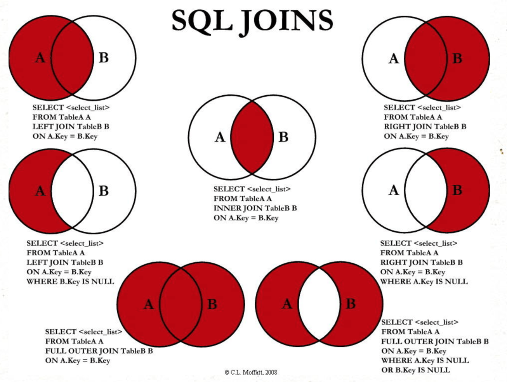

### 连接查询分类

##### 一、内连接

- **等值连接**
- **非等值连接**

##### 二、外连接

- **左外连接**
- **右外连接**
- **全外连接**

##### 三、交叉连接

**总览如图：**



### 一、SQL92标准（只支持内连接，不推荐使用92标准）

**1、等值连接**

通过 主键外键相等 作为过滤条件的连接查询，就是等值连接查询。结果是AB集合的交集。

```
select colA,colB from tableA,tableB
# 不加连接条件，直接多表查询，结果是 AB表 的笛卡尔积
# 通过 主键=外键 的条件筛选结果，所以称为等值连接查询
# n 张表的连接需要至少 n-1 个条件

select colA,colB from tableA,tableB
where A.bid = B.id  #等值连接
[and condition2]
#案例：查询有奖金的员工名，及其对应的部门名
select last_name,department_name
from employees e, department d
where e.department_id = d.department_id
AND e.allowance is not null;
```

**2、非等值连接**

通过 主键外键的非相等关系 作为过滤条件的连接查询，就是非等值连接。非相等关系比如：大于小于不等于

```
#查询员工工资及其对应工资级别
#通过用 salary 比较每个工资级别的最低和最高工资
select salary,grade_level
from employees e, job_grades g
where salary BETWEEN g.lowest_sal AND g.highest_sal
# and g.grade_level = 'A'  #只看工资级别是A的
```

**3、自连接**

既 自己和自己连接查询（注：并不是每张表都可以自连接查询）

```
#查询员工名和对应的上级名
select e.employee_id, e.last_name, m.employee_id, m.last_name
from employees e, employees m   # m 指看做 manager 表
where e.manager_id = m.employee_id
```


### 二、SQL99标准（推荐使用）

#### 1.内连接

- **等值连接**

  ```
  SELECT 查询列表
  FROM 表1 别名1
  [INNER] JOIN 表2 别名2  ON 等值连接条件
  [INNER] JOIN 表3 别名3  ON 等值连接条件
  WHERE [...]
  ```

  

- **非等值连接**

  ```
  SELECT 查询列表
  FROM 表1 别名1
  [INNER] JOIN 表2 别名2  ON 非等值连接条件
  [INNER] JOIN 表3 别名3  ON 非等值连接条件
  WHERE [...]
  ```

  

- **自连接**

  ```
  SELECT 查询列表
  FROM 表1 别名1
  [INNER] JOIN 表1 别名2  ON 连接条件
  WHERE [...]
  ```

  

#### 2.外连接

**外连接应用场景：查询一张表有，而另一张表没有的数据。**

**注意：** 1、外连接查询时，分为主表和从表，而且查询结果中会包含主表的每一条记录。主表的所有记录中，如果从表中有和它匹配的，则显示匹配的值，若没有，则填充 null。

​      既：外连接的查询结果 = 内连接查询结果 + 主表中有而从表中没有的记录

2、左外连接：**LEFT** JOIN **左边**是主表

​      右外连接：**RIGHT** JOIN **右边**是主表

3、也就是说，左外和右外交换两个表顺序其实可以实现同样的效果

**重点： 要把哪个表当做主表，主要是看最终的查询结果要哪个表的数据。**

- **左连接**

  ```
  举例：查询beauty表中 没有男朋友的 女明星
  SELECT g.name, b.*
  FROM beauty g
  LEFT OUTER JOIN  boys b
  ON g.boyfriend_id = b.id
  WHERE b.id IS NULL;    #连接条件一般取从表的主键
  ```

   

- **右连接**

  ```
  举例：查询beauty表中 没有男朋友的 女明星
  SELECT g.name, b.*
  FROM boys b
  RIGHT OUTER JOIN  beauty g
  ON g.boyfriend_id = b.id
  WHERE b.id IS NULL;    #连接条件一般取从表的主键
  ```

  

- **全外连接**

  ```
  #MySQL不支持全外连接查询
  #全外连接查询结果=内连查询结果 + A表有但B表没有的 + B表有但A表没有的
  ```

  

#### 3.交叉连接

关键字：CROSS  JOIN

```
SELECT *
FROM beauty g
CROSS JOIN boys b
#交叉连接就是笛卡尔积完整版。查询结果行数 = A表行数 * B表行数
```


