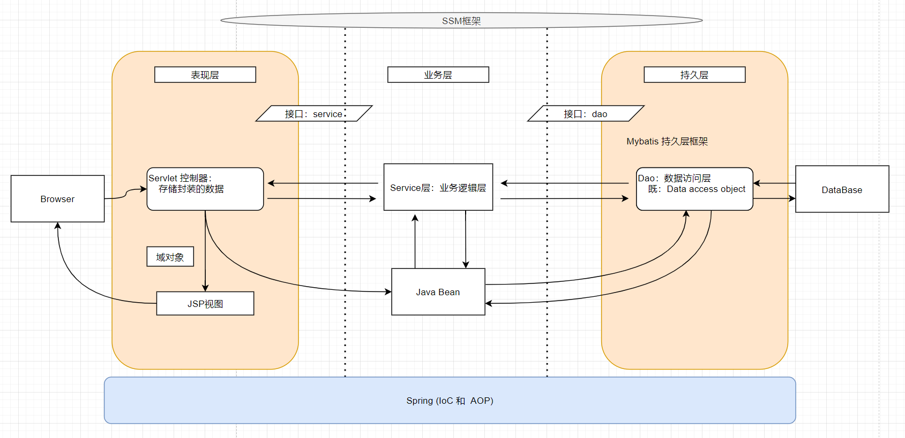

**1、框架**：

​	它是我们软件开发中的一套解决方案，不同框架解决不同的问题。

​	使用框架的好处：框架封装了很多细节，使开发者可以使用极简的方式实现功能，大大提高开发效率。

**2、三层架构：**

- 表现层：用于展示数据的

- 业务层：用于处理业务需求

- 持久层：用于和数据库交互

  

**3、持久层技术解决方案：**

​	JDBC技术：Connection - PreparedStatement - ResultSet

​	Spring的 JdbcTemplate ：Spring框架对JDBC的简单封装

​	Apache的DBUtils：同上，也是对JDBC的简单封装

但是，以上这些都不是框架：JDBC是规范，而 JdbcTemplate 和 DBUtils 是工具类。

**4、Mybatis概述：**

​	Mybatis是一个持久层框架，用java编写的，它封装了很多JDBC的操作细节，使开发者只需要关注SQL语句本身，而无需关注注册驱动，创建链接等繁杂过程。

它使用了ORM思想实现类对结果集的封装：

ORM：Object  Relational Mapping （对象关系映射）

简单的说：就是把数据库表和实体类的属性对应起来，让我们可以通过操作实体类就能实现对数据库表的操作。

| 数据库字段 | 实体类字段 |
| ---------- | ---------- |
| user       | user       |
| id         | userId     |
| user_name  | userName   |

